# Data Flow Diagram (DFD) — CrushHour Dating App

*Last updated: 2026-02-18*

---

## Table of Contents
1. [Level 0 - Context Diagram](#level-0---context-diagram)
2. [Level 1 - Main Processes](#level-1---main-processes)
3. [Level 2 - Process Decomposition](#level-2---process-decomposition)
4. [Level 3 - Detailed Flows](#level-3---detailed-flows)
5. [Level 4 - Sub-Process Details](#level-4---sub-process-details)
6. [Data Dictionary](#data-dictionary)
7. [Data Store Catalog](#data-store-catalog)

---

## Level 0 - Context Diagram

The highest-level view showing the system as a single process with all external entities.

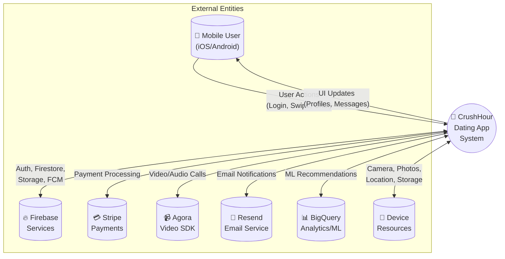

### External Entity Descriptions

| Entity | Type | Description |
|--------|------|-------------|
| Mobile User | Human | iOS/Android app user performing dating activities |
| Firebase Services | System | Authentication, Firestore DB, Cloud Storage, FCM, Cloud Functions |
| Stripe | System | Payment processing for subscriptions |
| Agora | System | Real-time video/audio calling SDK |
| Resend | System | Transactional email delivery |
| BigQuery | System | Analytics warehouse and ML-based recommendations |
| Device Resources | System | Camera, photo library, GPS location, secure storage |

---

## Level 1 - Main Processes

Decomposition of the system into major functional processes.

```mermaid
flowchart TB
    subgraph External
        U[("👤 User")]
        FB[("🔥 Firebase")]
        ST[("💳 Stripe")]
        AG[("📹 Agora")]
        RS[("📧 Resend")]
    end

    subgraph "CrushHour System"
        P1["1.0<br/>Authentication<br/>& Identity"]
        P2["2.0<br/>Profile<br/>Management"]
        P3["3.0<br/>Discovery<br/>& Matching"]
        P4["4.0<br/>Messaging<br/>& Chat"]
        P5["5.0<br/>Notifications"]
        P6["6.0<br/>Subscription<br/>& Payments"]
        P7["7.0<br/>Safety<br/>& Moderation"]
        P8["8.0<br/>Video<br/>Calling"]
    end

    subgraph "Data Stores"
        DS1[("D1: Users")]
        DS2[("D2: Matches")]
        DS3[("D3: Messages")]
        DS8[("D8: Message Requests")]
        DS4[("D4: Likes")]
        DS5[("D5: Local Cache")]
        DS6[("D6: Subscriptions")]
        DS7[("D7: Reports/Blocks")]
    end

    U -->|"Credentials"| P1
    P1 -->|"Auth Token"| U
    P1 <-->|"Auth State"| FB
    P1 <--> DS1

    U -->|"Profile Data"| P2
    P2 -->|"Profile View"| U
    P2 <--> DS1
    P2 <-->|"Media Files"| FB

    U -->|"Location, Prefs"| P3
    P3 -->|"Candidate Deck"| U
    P3 <--> DS1
    P3 <--> DS2
    P3 <--> DS4

    U -->|"Message Input"| P4
    P4 -->|"Chat History"| U
    P4 <--> DS2
    P4 <--> DS3
    P4 <--> DS8

    P1 -->|"Auth Events"| P5
    P3 -->|"Match Events"| P5
    P4 -->|"Message Events"| P5
    P5 -->|"Push/Email"| U
    P5 <-->|"FCM"| FB
    P5 -->|"Email"| RS

    U -->|"Payment Request"| P6
    P6 -->|"Plan Status"| U
    P6 <-->|"Checkout"| ST
    P6 <--> DS6

    U -->|"Report/Block"| P7
    P7 -->|"Safety Status"| U
    P7 <--> DS7
    P7 <--> DS1

    U -->|"Call Request"| P8
    P8 -->|"Video Stream"| U
    P8 <-->|"RTC Token"| AG
```

### Process Summary (Level 1)

| Process | Name | Description |
|---------|------|-------------|
| 1.0 | Authentication & Identity | User registration, login, password management, verification |
| 2.0 | Profile Management | Create, update, media upload, completeness tracking |
| 3.0 | Discovery & Matching | Deck loading, swiping, match creation, ML recommendations |
| 4.0 | Messaging & Chat | Send/receive messages, message requests, reactions, read status |
| 5.0 | Notifications | Push notifications, email alerts, event triggers |
| 6.0 | Subscription & Payments | Stripe checkout, webhook handling, plan management |
| 7.0 | Safety & Moderation | Reporting, blocking, content moderation |
| 8.0 | Video Calling | Agora token generation, call management |

---

## Level 2 - Process Decomposition

### 2.1 Process 1.0 - Authentication & Identity

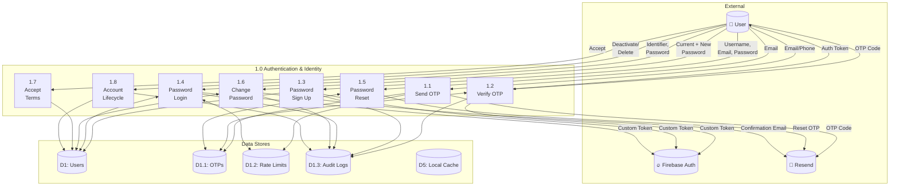

#### Data Flows - Authentication

| Flow | From | To | Data |
|------|------|-----|------|
| DF1.1 | User | 1.1 Send OTP | email, phone, purpose |
| DF1.2 | 1.1 | Resend | to, otp, purpose |
| DF1.3 | User | 1.2 Verify OTP | identifier, otp |
| DF1.4 | 1.2 | User | customToken, user object |
| DF1.5 | User | 1.3 Sign Up | username, email, password |
| DF1.6 | 1.3 | D1 Users | uid, email, username, passwordHash |
| DF1.7 | User | 1.4 Login | identifier, password |
| DF1.8 | 1.4 | User | customToken, user object |
| DF1.9 | User | 1.6 Change Password | currentPassword, newPassword |
| DF1.10 | 1.6 | Resend | Password changed email |

---

### 2.2 Process 2.0 - Profile Management

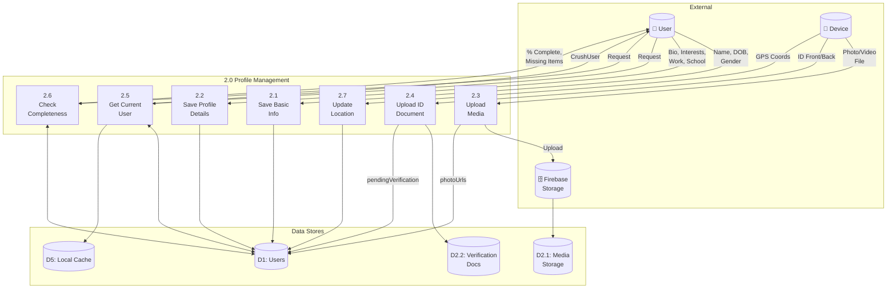

#### Data Flows - Profile Management

| Flow | From | To | Data |
|------|------|-----|------|
| DF2.1 | User | 2.1 Basic Info | name, dateOfBirth, gender, orientation |
| DF2.2 | 2.1 | D1 Users | profile.name, profile.dateOfBirth, profile.gender |
| DF2.3 | User | 2.2 Details | bio, interests[], jobTitle, company, school |
| DF2.4 | Device | 2.3 Upload | File (bytes), contentType |
| DF2.5 | 2.3 | Storage | users/{uid}/media/{fileName} |
| DF2.6 | 2.3 | D1 Users | photoUrls[] |
| DF2.7 | 2.6 | User | {percentage, missingItems[], isComplete} |

---

### 2.3 Process 3.0 - Discovery & Matching

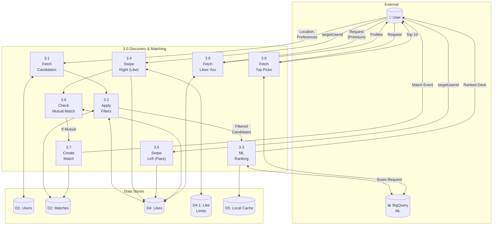

#### Data Flows - Discovery & Matching

| Flow | From | To | Data |
|------|------|-----|------|
| DF3.1 | User | 3.1 Fetch | userId, location, preferences |
| DF3.2 | 3.1 | D1 Users | Query: nearby users, age range, gender |
| DF3.3 | 3.2 | 3.3 ML | candidateIds[], userFeatures |
| DF3.4 | BigQuery | 3.3 | scores[], rankings |
| DF3.5 | User | 3.4 Like | targetUserId |
| DF3.6 | 3.4 | D4 Likes | {likerId, likedId, timestamp, type} |
| DF3.7 | 3.6 | 3.7 | isMutual: true |
| DF3.8 | 3.7 | D2 Matches | {user1Id, user2Id, status, createdAt} |
| DF3.9 | 3.7 | Notifications | Match event trigger |
| DF3.10 | User | 3.8 Fetch Likes You | userId |
| DF3.11 | 3.8 | User | liked profiles (blurred for free users) |

---

### 2.4 Process 4.0 - Messaging & Chat

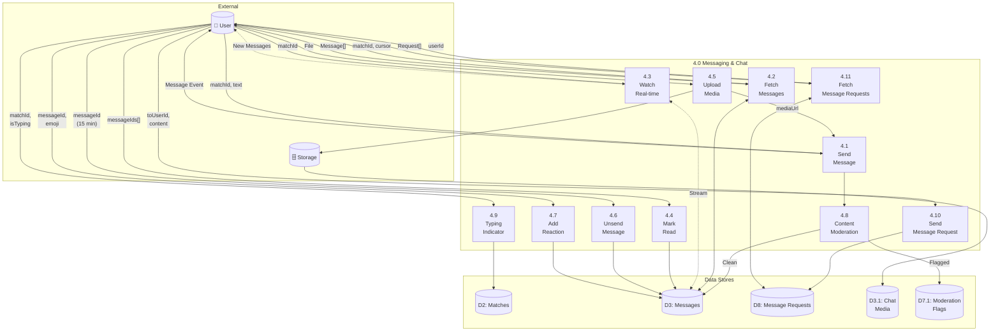

#### Data Flows - Messaging

| Flow | From | To | Data |
|------|------|-----|------|
| DF4.1 | User | 4.1 Send | matchId, text, mediaUrl?, replyTo? |
| DF4.2 | 4.1 | D3 Messages | {id, senderId, text, timestamp, sendStatus} |
| DF4.3 | 4.8 | D3 | moderationStatus, flags[] |
| DF4.4 | User | 4.2 Fetch | matchId, limit, cursor |
| DF4.5 | D3 | 4.2 | Message[] with pagination |
| DF4.6 | 4.3 | User | Real-time message stream |
| DF4.7 | User | 4.7 React | messageId, emoji (❤️ 😂 😮 😢 😡 👍) |
| DF4.8 | User | 4.10 Send Request | toUserId, content |
| DF4.9 | 4.10 | D8 Message Requests | {id, fromUserId, toUserId, content, expiresAt} |
| DF4.10 | User | 4.11 Fetch Requests | userId |
| DF4.11 | D8 | 4.11 | MessageRequest[] |
| DF4.12 | 4.11 | User | MessageRequest list |

---

### 2.5 Process 5.0 - Notifications

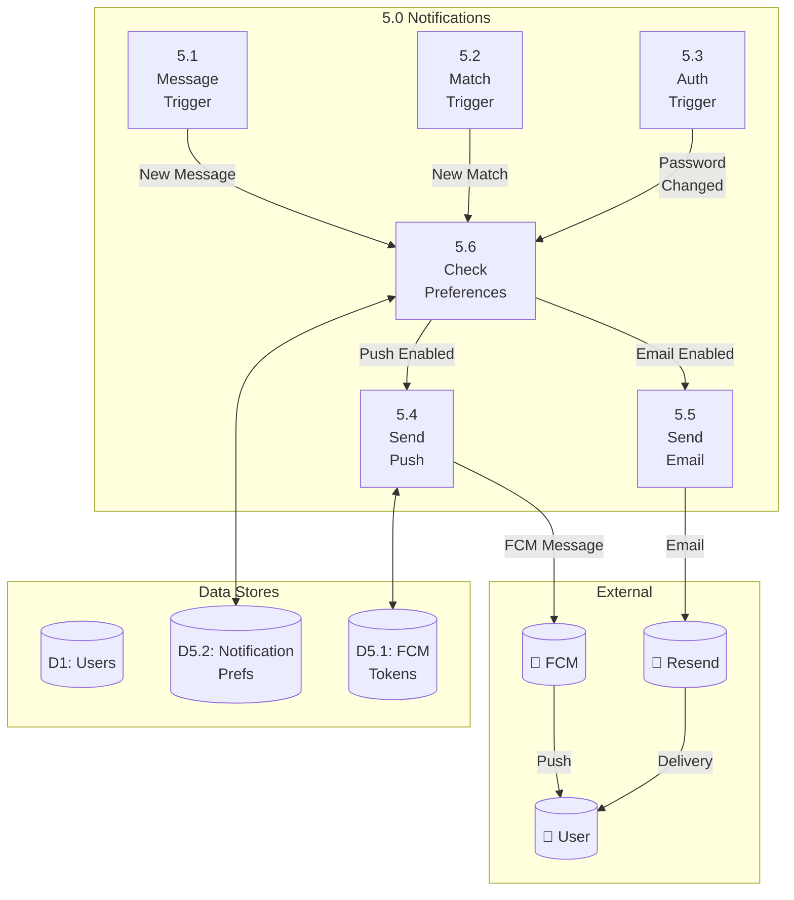

---

### 2.6 Process 6.0 - Subscription & Payments

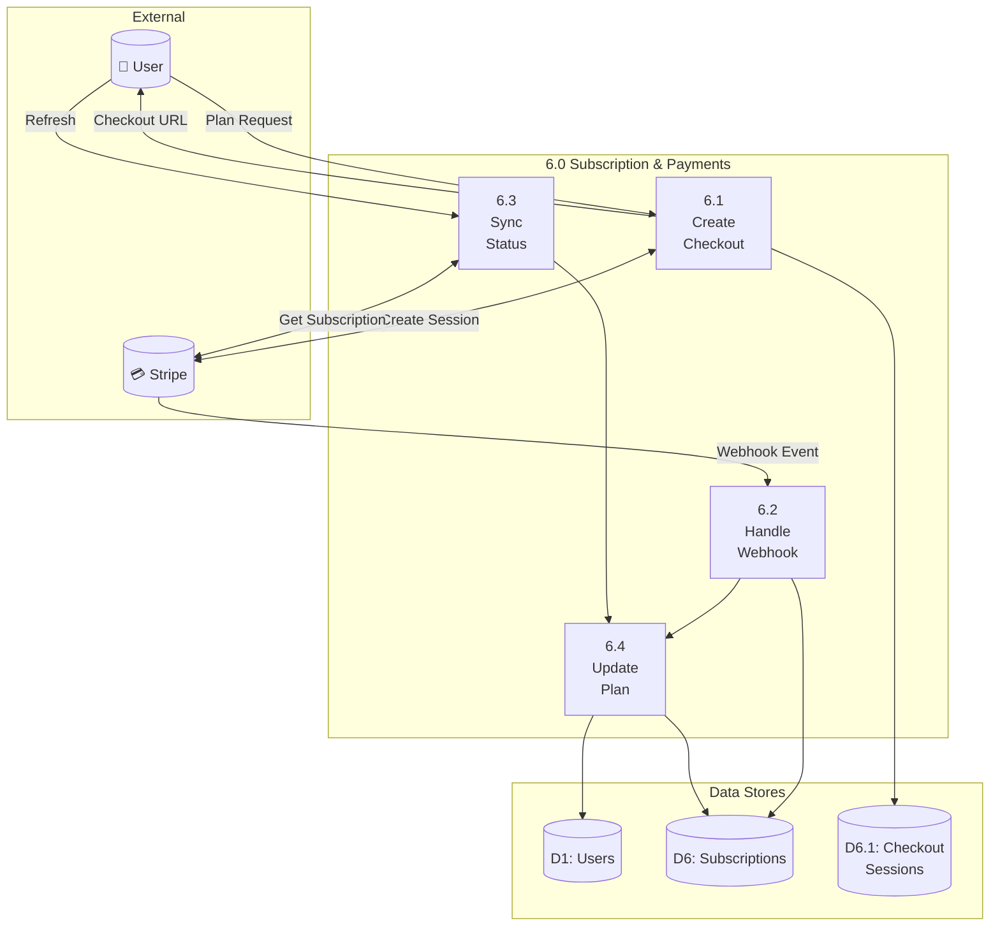

#### Data Flows - Payments

| Flow | From | To | Data |
|------|------|-----|------|
| DF6.1 | User | 6.1 Checkout | userId, planId |
| DF6.2 | 6.1 | Stripe | customerId, priceId, successUrl, cancelUrl |
| DF6.3 | Stripe | 6.1 | checkoutSessionId, url |
| DF6.4 | Stripe | 6.2 Webhook | event (checkout.session.completed, etc.) |
| DF6.5 | 6.4 | D1 Users | plan: "plus" or "free" |
| DF6.6 | 6.4 | D6 | stripeCustomerId, subscriptionId, status |

---

### 2.7 Process 7.0 - Safety & Moderation

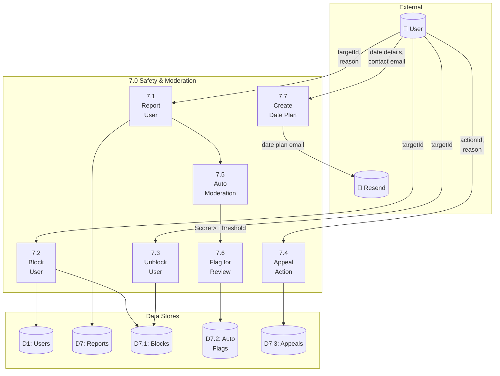

---

#### Data Flows - Safety

| Flow | From | To | Data |
|------|------|-----|------|
| DF7.1 | User | 7.1 Report | targetId, reason |
| DF7.2 | 7.2 Report | D7 Reports | report data |
| DF7.3 | User | 7.2 Block | targetId |
| DF7.4 | User | 7.3 Unblock | targetId |
| DF7.5 | User | 7.4 Appeal | actionId, reason |
| DF7.6 | 7.6 Flag | D7.2 Auto Flags | flag record |
| DF7.7 | User | 7.7 Create Date Plan | matchName, dateTime, location, contact |
| DF7.8 | 7.7 Create Date Plan | Resend | email notification |

### 2.8 Process 8.0 - Video Calling

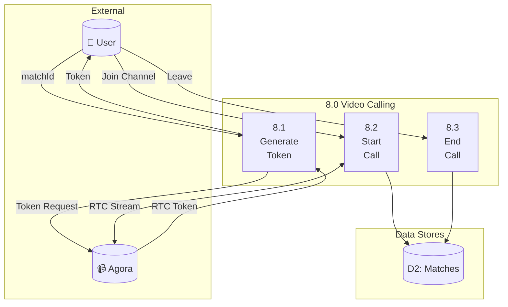

---

## Level 3 - Detailed Flows

### 3.1 Authentication - OTP Flow (Process 1.1 + 1.2)

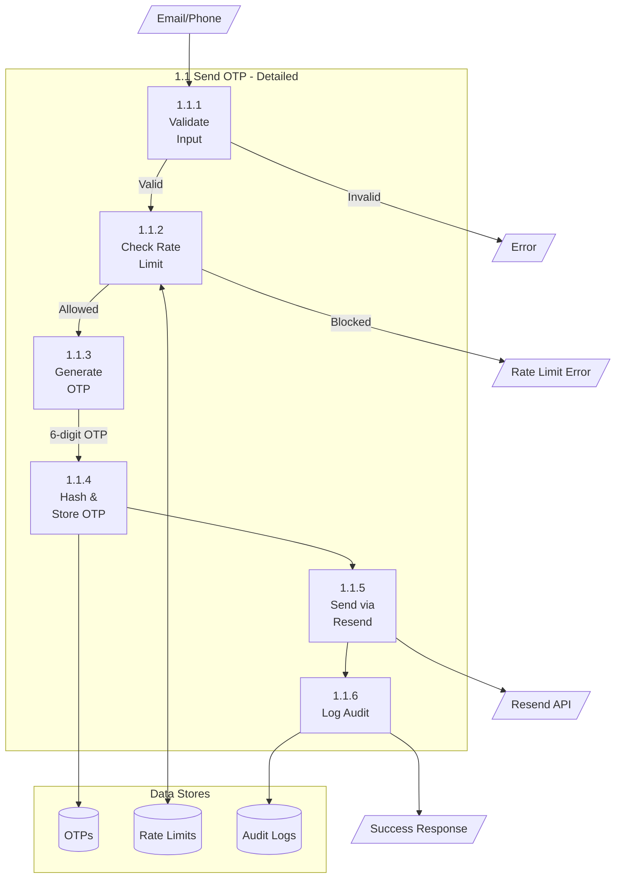

### 3.2 Discovery - Candidate Fetching (Process 3.1 + 3.2 + 3.3)

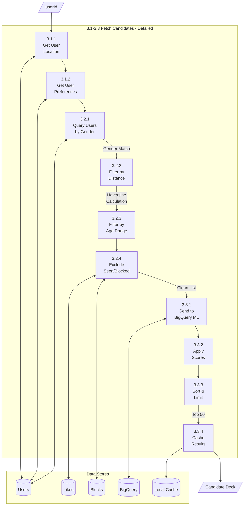

### 3.3 Messaging - Send Message (Process 4.1 + 4.8)

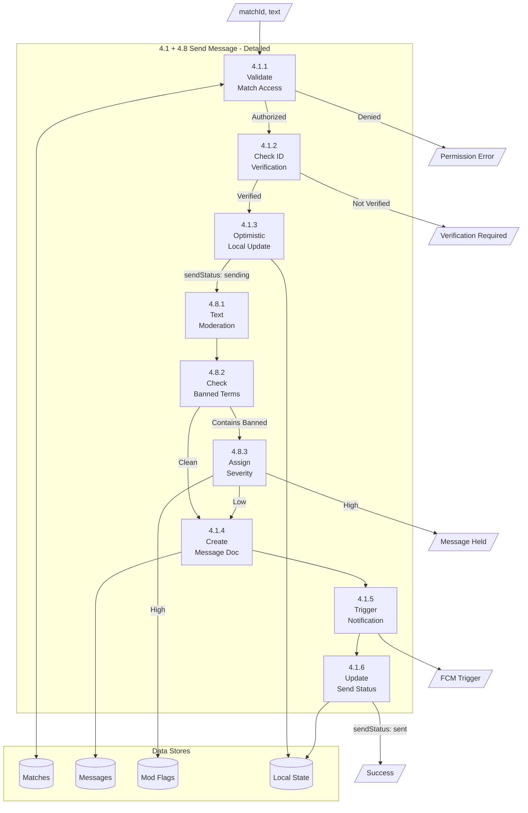

---

## Level 4 - Sub-Process Details

### 4.1 Password Hashing (Sub-process of 1.3, 1.4, 1.6)

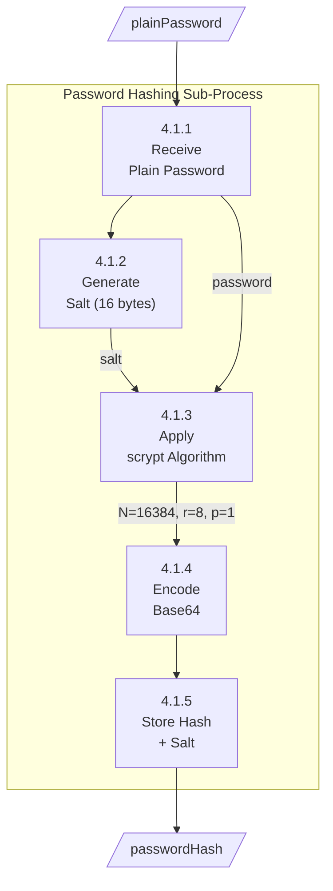

### 4.2 Distance Calculation (Sub-process of 3.2.2)

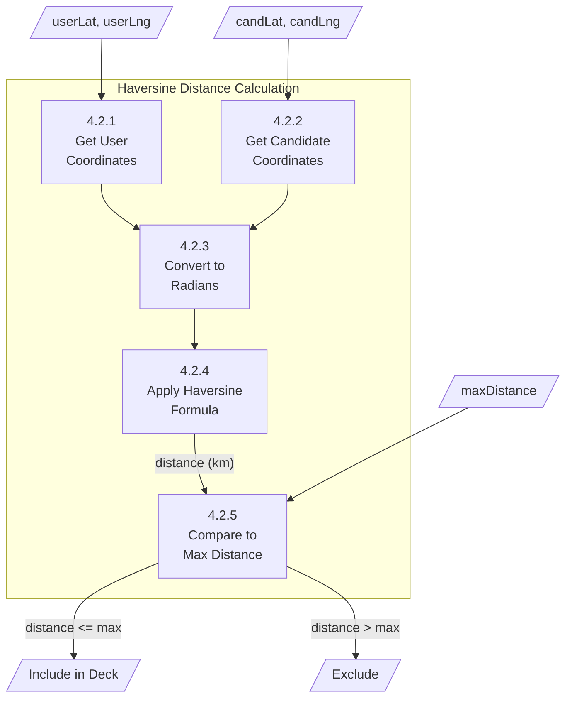

### 4.3 Content Moderation Scoring (Sub-process of 4.8)

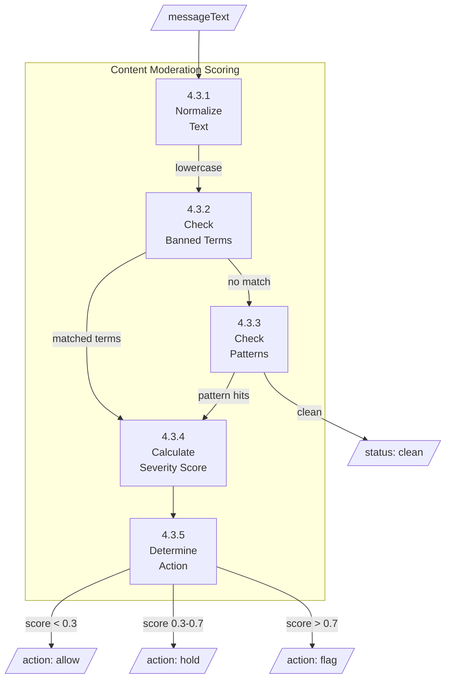

### 4.4 Rate Limiting Check (Sub-process of 1.1, 1.4)

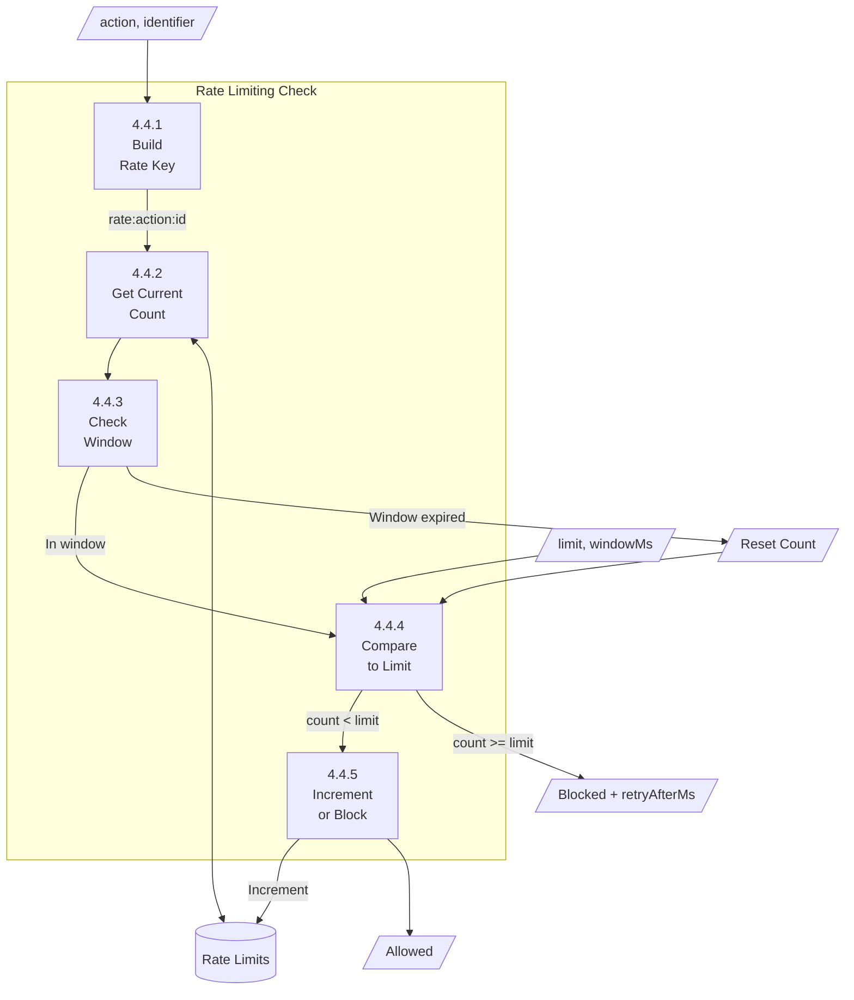

---

## Data Dictionary

### User Entity (D1)

| Field | Type | Description |
|-------|------|-------------|
| uid | string | Firebase Auth UID (primary key) |
| email | string | User's email address |
| emailLower | string | Lowercase email for queries |
| username | string | Unique username |
| usernameLower | string | Lowercase username for queries |
| phoneNumber | string? | Phone number (optional) |
| passwordHash | string | scrypt hashed password |
| passwordSalt | string | Salt for password hash |
| plan | enum | "free" \| "plus" |
| isEmailVerified | boolean | Email verification status |
| isPhoneVerified | boolean | Phone verification status |
| isIdVerified | boolean | ID verification status |
| hasAcceptedTerms | boolean | T&C acceptance |
| hasCompletedBasicInfo | boolean | Basic info complete |
| hasCompletedProfileSetup | boolean | Profile complete |
| profile | object | Nested profile data |
| profile.name | string | First name (private by default) |
| profile.lastName | string? | Last name (private by default) |
| profile.dateOfBirth | timestamp | Date of birth |
| profile.gender | enum | "female" \| "male" \| "non-binary" |
| profile.orientation | enum | Sexual orientation |
| profile.bio | string | About me (max 500) |
| profile.photoUrls | string[] | Profile photo URLs |
| profile.interests | string[] | Interest tags |
| profile.jobTitle | string? | Job title |
| profile.company | string? | Company name |
| profile.school | string? | School name |
| profile.city | string? | City |
| profile.country | string? | Country |
| profile.latitude | number? | GPS latitude |
| profile.longitude | number? | GPS longitude |
| profile.privacySettings | object | Privacy flags for profile fields |
| profile.privacySettings.showFirstName | boolean | Show first name publicly |
| profile.privacySettings.showLastName | boolean | Show last name publicly |
| notificationPrefs | object | Notification settings |
| notificationPrefs.push | boolean | Push enabled |
| notificationPrefs.email | boolean | Email enabled |
| notificationPrefs.sound | boolean | Sound enabled |
| notificationPrefs.vibration | boolean | Vibration enabled |
| createdAt | timestamp | Account creation |
| updatedAt | timestamp | Last update |

### Match Entity (D2)

| Field | Type | Description |
|-------|------|-------------|
| id | string | Match document ID |
| user1Id | string | First user UID |
| user2Id | string | Second user UID |
| participants | string[] | [user1Id, user2Id] for queries |
| status | enum | "active" \| "unmatched" |
| user1Typing | boolean | User 1 typing indicator |
| user2Typing | boolean | User 2 typing indicator |
| lastMessageAt | timestamp? | Last message timestamp |
| lastMessagePreview | string? | Preview text |
| createdAt | timestamp | Match creation |

### Message Entity (D3)

| Field | Type | Description |
|-------|------|-------------|
| id | string | Message document ID |
| matchId | string | Parent match ID |
| senderId | string | Sender UID |
| text | string | Message content |
| mediaUrl | string? | Attached media URL |
| mediaType | enum? | "image" \| "video" |
| replyTo | string? | Reply reference ID |
| reactions | map | {emoji: userId[]} |
| readBy | string[] | UIDs who read |
| sendStatus | enum | "sending" \| "sent" \| "failed" |
| moderationStatus | enum | "clean" \| "flagged" \| "held" |
| isDeleted | boolean | Soft delete flag |
| deletedFor | string[] | UIDs for whom deleted |
| createdAt | timestamp | Send timestamp |
| editedAt | timestamp? | Last edit timestamp |

### Message Request Entity (D8)

| Field | Type | Description |
|-------|------|-------------|
| id | string | Message request document ID (pair key) |
| fromUserId | string | Sender UID |
| toUserId | string | Recipient UID |
| content | string | Request message content |
| type | enum | "text" \| "image" \| "video" \| "voice" |
| sentAt | timestamp | Sent timestamp |
| expiresAt | timestamp | Auto-expire after 48 hours |
| fromUserName | string? | Denormalized sender name |
| fromUserPhotoUrl | string? | Denormalized sender photo |
| toUserName | string? | Denormalized recipient name |
| toUserPhotoUrl | string? | Denormalized recipient photo |

### Like Entity (D4)

| Field | Type | Description |
|-------|------|-------------|
| id | string | Like document ID |
| likerId | string | User who liked |
| likedId | string | User who was liked |
| type | enum | "like" \| "superlike" |
| createdAt | timestamp | Like timestamp |

### Report Entity (D7)

| Field | Type | Description |
|-------|------|-------------|
| id | string | Report document ID |
| reporterId | string | Reporter UID |
| reportedId | string | Reported user UID |
| reason | enum | Report reason category |
| details | string? | Additional details |
| status | enum | "pending" \| "reviewed" \| "resolved" |
| createdAt | timestamp | Report timestamp |
| reviewedAt | timestamp? | Review timestamp |

---

## Data Store Catalog

### Firestore Collections

| Store ID | Collection Path | Description | Access |
|----------|-----------------|-------------|--------|
| D1 | `/users/{uid}` | User profiles | Read: all, Write: owner |
| D1.1 | `/auth_email_otps/{id}` | OTP records | Server only |
| D1.2 | `/auth_rate_limits/{key}` | Rate limiting | Server only |
| D1.3 | `/auth_audit_logs/{id}` | Auth audit trail | Server only |
| D2 | `/matches/{id}` | Match records | Participants only |
| D3 | `/matches/{id}/messages/{id}` | Chat messages | Participants only |
| D8 | `/message_requests/{id}` | Pre-match message requests | Participants only |
| D4 | `/likes/{id}` | Like records | Server managed |
| D4.1 | `/like_limits/{uid}` | Daily like limits | Server only |
| D5.1 | `/users/{uid}/fcmTokens/{token}` | FCM tokens | Owner only |
| D6 | `/subscriptions/{uid}` | Subscription status | Owner + server |
| D6.1 | `/checkout_sessions/{id}` | Checkout tracking | Server only |
| D7 | `/reports/{id}` | User reports | Reporter + admin |
| D7.1 | `/blocks/{id}` | User blocks | Blocker only |
| D7.2 | `/automatedFlags/{id}` | Auto-moderation | Server only |
| D7.3 | `/safetyAppeals/{id}` | Appeals | Appellant + admin |

### Firebase Storage Buckets

| Store ID | Path Pattern | Description | Access |
|----------|--------------|-------------|--------|
| DS_MEDIA | `/users/{uid}/media/*` | Profile photos/videos | Public read |
| DS_CHAT | `/chat_media/{matchId}/{uid}/*` | Chat attachments | Participants |
| DS_VERIFY | `/verification/{uid}/*` | ID documents | Server only |

### Local Storage

| Store ID | Technology | Description |
|----------|------------|-------------|
| DS_LOCAL | SharedPreferences | Cache, settings, flags |
| DS_SECURE | FlutterSecureStorage | Auth tokens, identifiers |
| DS_FIRESTORE_CACHE | Firestore SDK | Offline document cache |

---

## Summary

| Level | Processes | Data Stores | External Entities |
|-------|-----------|-------------|-------------------|
| 0 | 1 (System) | - | 7 |
| 1 | 8 | 8 | 5 |
| 2 | 50+ | 15+ | 6 |
| 3 | 25+ detailed | - | - |
| 4 | 4 sub-processes | - | - |

**Total Data Flows Documented:** 60+
**Total Processes:** 80+
**Total Data Stores:** 21+

---

## Revision Notes

- **2026-02-23 (Web Discovery Stories):**
  - Added active profile story flow in discovery:
    - Story media upload (`users/{uid}/stories/*` media path in storage)
    - Story retrieval for discovery candidates
    - Story view tracking (`users/{ownerId}/stories/{storyId}/views/{viewerId}`)
  - Added story viewer process with per-story progress and persisted view-count increment.
