# Project ER Diagram — CrushHour Dating App

*Last updated: 2026-03-08*

---

## Table of Contents
1. [Overview](#1-overview)
2. [Conceptual ER Diagram (Level 1)](#2-conceptual-er-diagram-level-1)
3. [Logical ER Diagram (Level 2)](#3-logical-er-diagram-level-2)
4. [Physical ER Diagram (Level 3)](#4-physical-er-diagram-level-3)
5. [Indexing Strategy](#5-indexing-strategy)
6. [Security Rules Summary](#6-security-rules-summary)
7. [Data Dictionary](#7-data-dictionary)
8. [Relationship Matrix](#8-relationship-matrix)

---

## 1) Overview

CrushHour is a dating application built with Flutter and Firebase Firestore. The data model consists of **26 main entities** organized into the following domains:

| Domain | Entities | Description |
|--------|----------|-------------|
| **Auth & Users** | 6 | User accounts, profiles, preferences, privacy |
| **Discovery** | 6 | Likes, swipes, matches, weekly picks |
| **Messaging** | 3 | Chat messages, message requests, online presence |
| **Safety** | 4 | Reports, blocks, date plans, emergency contacts |
| **Verification & Calls** | 2 | Photo verification, audio/video calls |
| **Social** | 4 | Reactions, stories, quizzes |
| **Analytics** | 1 | Profile insights and metrics |

### Entity Summary

```
Total Entities: 26
├── Core Domain: 6
│   └── CrushUser, Profile, DiscoveryPreferences, ProfilePrivacySettings, ProfileFavourites, ProfilePrompt
├── Discovery Domain: 6
│   └── CrushMatch, Like, Swipe, WeeklyPicks, DailyLikesLimit, LikePriority
├── Messaging Domain: 3
│   └── Message, MessageRequest, Presence
├── Safety Domain: 4
│   └── Block, Report, DatePlan, EmergencyContact
├── Verification & Calls: 2
│   └── PhotoVerification, Call
├── Social Domain: 4
│   └── ProfileReaction, ProfileStory, CompatibilityQuiz, QuizResult
└── Analytics Domain: 1
    └── ProfileInsights
```

Note: Date plan email notifications are sent via Resend and are not persisted as a separate entity.
Note: Likes You previews are derived from Like records and do not introduce new entities.
Note: `ChatTransportAdapter` is an application-layer abstraction for chat transport swapability; it does not add new persisted entities.

---

## 2) Conceptual ER Diagram (Level 1)

### 2.1 Master ER Diagram

```mermaid
erDiagram
    %% ═══════════════════════════════════════════════════════════════
    %% AUTH & USER DOMAIN
    %% ═══════════════════════════════════════════════════════════════
    CrushUser ||--|| Profile : "has"
    Profile ||--o{ ProfilePrompt : "contains max 3"
    Profile ||--|| DiscoveryPreferences : "has"
    Profile ||--|| ProfilePrivacySettings : "has"
    Profile ||--|| ProfileFavourites : "has"
    CrushUser ||--o| PhotoVerification : "may have"

    %% ═══════════════════════════════════════════════════════════════
    %% DISCOVERY DOMAIN
    %% ═══════════════════════════════════════════════════════════════
    CrushUser ||--o{ Like : "sends"
    CrushUser ||--o{ Like : "receives"
    CrushUser ||--o{ Swipe : "performs"
    Like ||--o| LikePriority : "has"
    CrushUser ||--o{ CrushMatch : "participates in"
    CrushUser ||--o| WeeklyPicks : "receives"
    CrushUser ||--o| DailyLikesLimit : "has"

    %% ═══════════════════════════════════════════════════════════════
    %% MESSAGING DOMAIN
    %% ═══════════════════════════════════════════════════════════════
    CrushMatch ||--o{ Message : "contains"
    CrushUser ||--o{ Message : "sends"
    CrushUser ||--o{ MessageRequest : "sends"
    CrushUser ||--o{ MessageRequest : "receives"
    CrushUser ||--|| Presence : "has"

    %% ═══════════════════════════════════════════════════════════════
    %% SAFETY DOMAIN
    %% ═══════════════════════════════════════════════════════════════
    CrushUser ||--o{ Block : "creates"
    CrushUser ||--o{ Report : "files"
    CrushUser ||--o{ DatePlan : "creates"
    DatePlan ||--o{ EmergencyContact : "shared with"

    %% ═══════════════════════════════════════════════════════════════
    %% CALLS DOMAIN
    %% ═══════════════════════════════════════════════════════════════
    CrushUser ||--o{ Call : "initiates"
    CrushUser ||--o{ Call : "receives"

    %% ═══════════════════════════════════════════════════════════════
    %% SOCIAL DOMAIN
    %% ═══════════════════════════════════════════════════════════════
    CrushUser ||--o{ ProfileReaction : "sends"
    CrushUser ||--o{ ProfileStory : "posts"
    CompatibilityQuiz ||--o{ QuizResult : "produces"
    CrushUser ||--o{ QuizResult : "participates in"

    %% ═══════════════════════════════════════════════════════════════
    %% ANALYTICS DOMAIN
    %% ═══════════════════════════════════════════════════════════════
    CrushUser ||--o| ProfileInsights : "has"
```

### 2.2 Domain Groupings

```
┌─────────────────────────────────────────────────────────────────────────────┐
│                              AUTH & USERS                                    │
├─────────────────────────────────────────────────────────────────────────────┤
│  CrushUser ─────── Profile ─────── DiscoveryPreferences                     │
│      │                │                                                      │
│      │                ├─────── ProfilePrivacySettings                       │
│      │                │                                                      │
│      │                ├─────── ProfileFavourites                            │
│      │                │                                                      │
│      │                └─────── ProfilePrompt[] (1:N, max 3)                 │
│      │                                                                       │
│      └─────── PhotoVerification (1:1)                                       │
└─────────────────────────────────────────────────────────────────────────────┘

┌─────────────────────────────────────────────────────────────────────────────┐
│                              DISCOVERY                                       │
├─────────────────────────────────────────────────────────────────────────────┤
│  CrushUser ──────┬───── Like (N:M via sender/receiver)                      │
│      │           │         │                                                 │
│      │           │         └─────── LikePriority (1:1)                      │
│      │           │                                                          │
│      │           ├───── Swipe (1:N)                                         │
│      │           │                                                          │
│      │           ├───── CrushMatch (N:M via participants)                   │
│      │           │                                                          │
│      │           ├───── WeeklyPicks (1:1)                                   │
│      │           │                                                          │
│      │           └───── DailyLikesLimit (1:1)                              │
└─────────────────────────────────────────────────────────────────────────────┘

┌─────────────────────────────────────────────────────────────────────────────┐
│                              MESSAGING                                       │
├─────────────────────────────────────────────────────────────────────────────┤
│  CrushMatch ─────────── Message (1:N subcollection)                         │
│      │                     │                                                 │
│      └─────────────────────┼───── fromUser (FK to CrushUser)               │
│                            │                                                 │
│                            └───── toUser (FK to CrushUser)                  │
│                                                                              │
│  CrushUser ─────────── MessageRequest (1:N, pre-match)                      │
│      │                     │                                                 │
│      └─────────────────────┼───── fromUser (FK to CrushUser)               │
│                            │                                                 │
│                            └───── toUser (FK to CrushUser)                  │
│                                                                              │
│  CrushUser ──────────── Presence (1:1)                                      │
└─────────────────────────────────────────────────────────────────────────────┘

┌─────────────────────────────────────────────────────────────────────────────┐
│                              SAFETY                                          │
├─────────────────────────────────────────────────────────────────────────────┤
│  CrushUser ──────┬───── Block (1:N as blocker)                              │
│                  │                                                           │
│                  ├───── Report (1:N as reporter)                            │
│                  │                                                           │
│                  └───── DatePlan (1:N) ───── EmergencyContact[] (embedded) │
└─────────────────────────────────────────────────────────────────────────────┘

┌─────────────────────────────────────────────────────────────────────────────┐
│                              CALLS                                           │
├─────────────────────────────────────────────────────────────────────────────┤
│  CrushUser ──────┬───── Call (1:N as caller)                                │
│                  │                                                           │
│                  └───── Call (1:N as receiver)                              │
└─────────────────────────────────────────────────────────────────────────────┘

┌─────────────────────────────────────────────────────────────────────────────┐
│                              SOCIAL                                          │
├─────────────────────────────────────────────────────────────────────────────┤
│  CrushUser ──────┬───── ProfileReaction (1:N as sender)                     │
│                  │                                                           │
│                  ├───── ProfileStory (1:N)                                  │
│                  │                                                           │
│                  └───── QuizResult (N:M with another User)                  │
│                              │                                               │
│  CompatibilityQuiz ──────────┘ (1:N)                                        │
└─────────────────────────────────────────────────────────────────────────────┘

┌─────────────────────────────────────────────────────────────────────────────┐
│                              ANALYTICS                                       │
├─────────────────────────────────────────────────────────────────────────────┤
│  CrushUser ───── ProfileInsights (1:1)                                      │
│                       │                                                      │
│                       ├───── DailyMetric[] (embedded)                       │
│                       │                                                      │
│                       └───── DemographicBreakdown (embedded)                │
└─────────────────────────────────────────────────────────────────────────────┘
```

### 2.3 Cardinality Summary

| Relationship | Cardinality | Notes |
|--------------|-------------|-------|
| CrushUser → Profile | 1:1 | Nested document |
| Profile → ProfilePrompt | 1:N | Max 3 prompts |
| Profile → DiscoveryPreferences | 1:1 | Nested map |
| Profile → ProfilePrivacySettings | 1:1 | Nested map |
| Profile → ProfileFavourites | 1:1 | Nested map |
| CrushUser → CrushMatch | N:M | Via userIds array |
| CrushMatch → Message | 1:N | Subcollection |
| CrushUser → Like | 1:N | As sender |
| CrushUser ← Like | 1:N | As receiver |
| CrushUser → Swipe | 1:N | |
| CrushUser → Block | 1:N | As blocker |
| CrushUser → Report | 1:N | As reporter |
| CrushUser → PhotoVerification | 1:1 | Optional |
| CrushUser → Call | 1:N | As caller/receiver |
| CrushUser → ProfileReaction | 1:N | As sender |
| CrushUser → ProfileStory | 1:N | |
| CrushUser → QuizResult | N:M | Two participants per result |
| CompatibilityQuiz → QuizResult | 1:N | |
| CrushUser → ProfileInsights | 1:1 | |
| CrushUser → Presence | 1:1 | |
| CrushUser → WeeklyPicks | 1:1 | Weekly refresh |
| CrushUser → DailyLikesLimit | 1:1 | Daily reset |
| Like → LikePriority | 1:1 | Optional scoring |
| DatePlan → EmergencyContact | 1:N | Embedded array |

---

## 3) Logical ER Diagram (Level 2)

### 3.1 CrushUser Entity

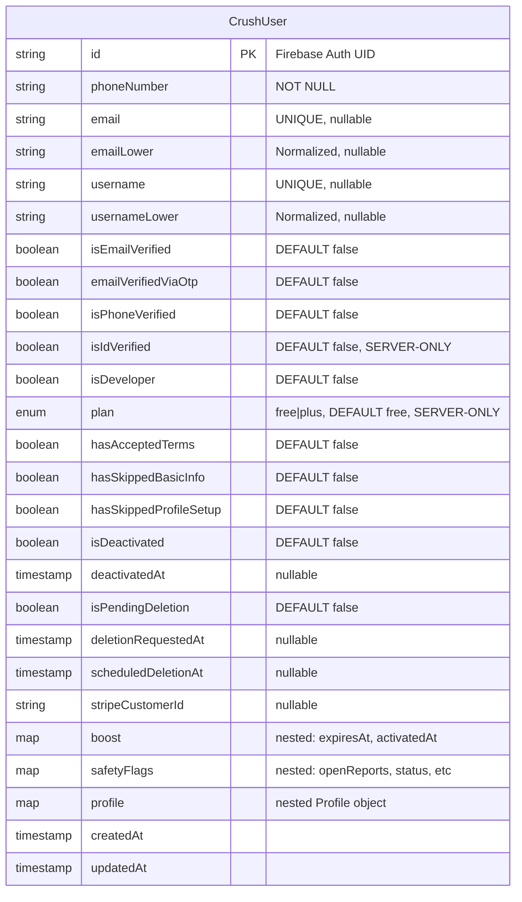

### 3.2 Profile Entity (Nested in CrushUser)

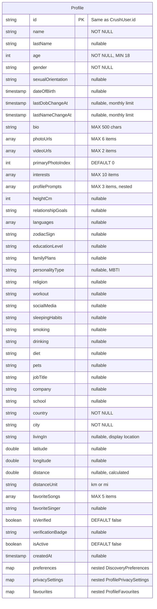

### 3.3 DiscoveryPreferences Entity (Nested)

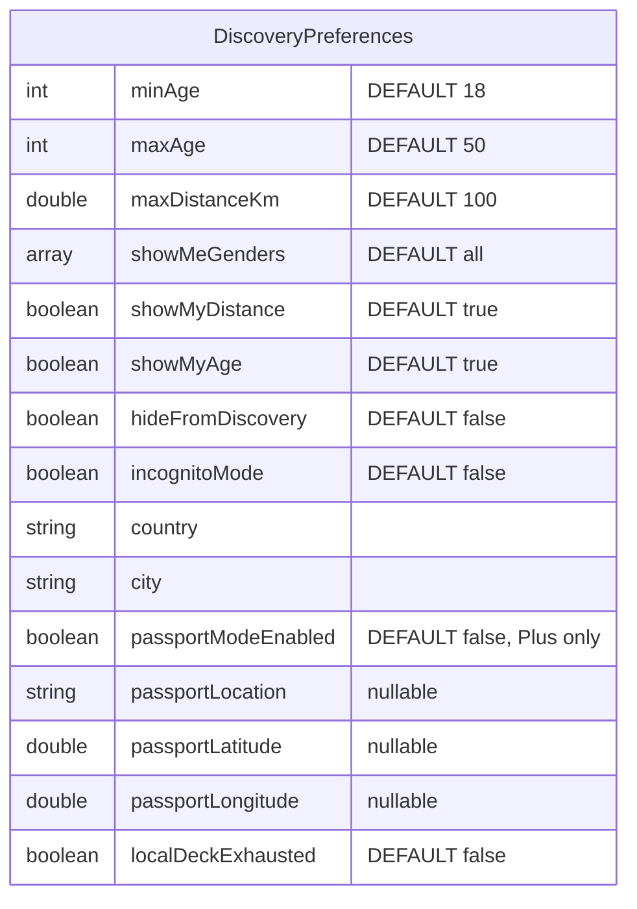

### 3.4 ProfilePrivacySettings Entity (Nested)

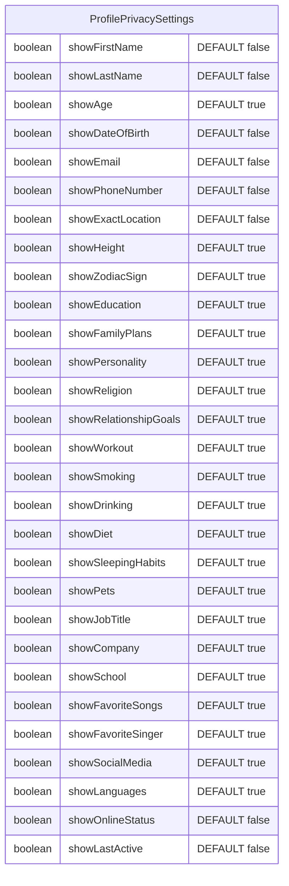

### 3.5 ProfileFavourites Entity (Nested)

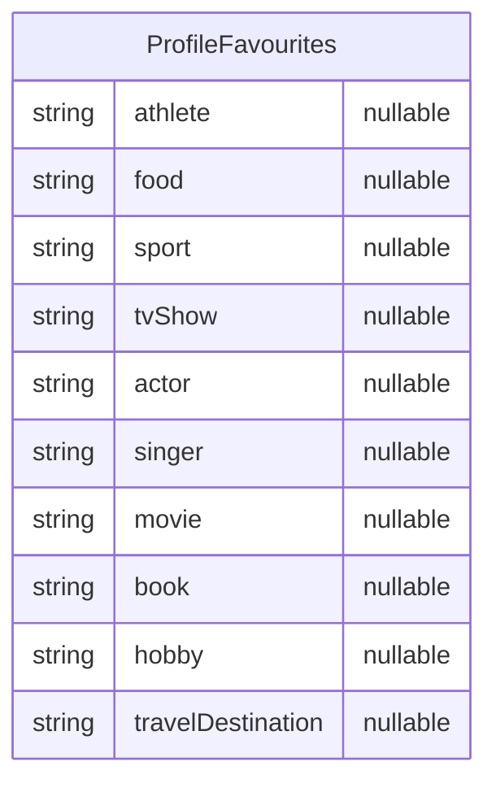

### 3.6 ProfilePrompt Entity (Nested Array)

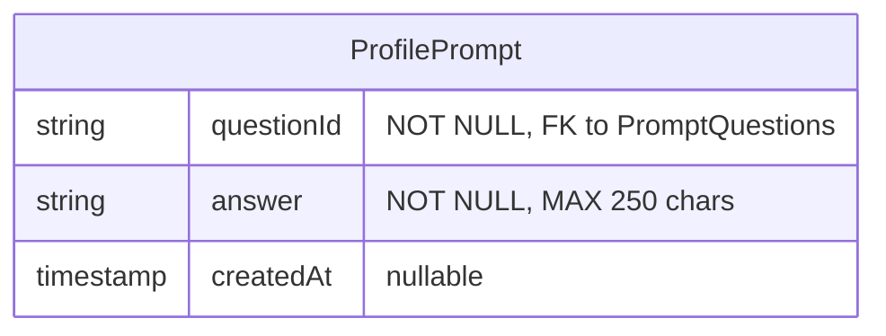

### 3.7 CrushMatch Entity

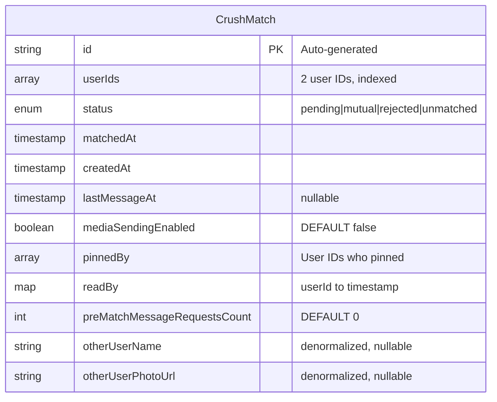

### 3.8 Message Entity (Subcollection)

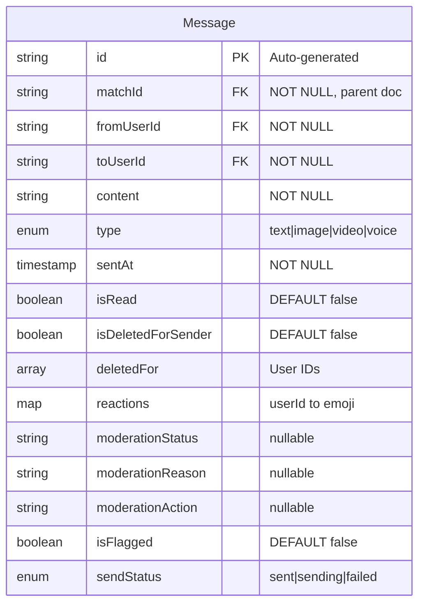

### 3.9 MessageRequest Entity (Pre-match)

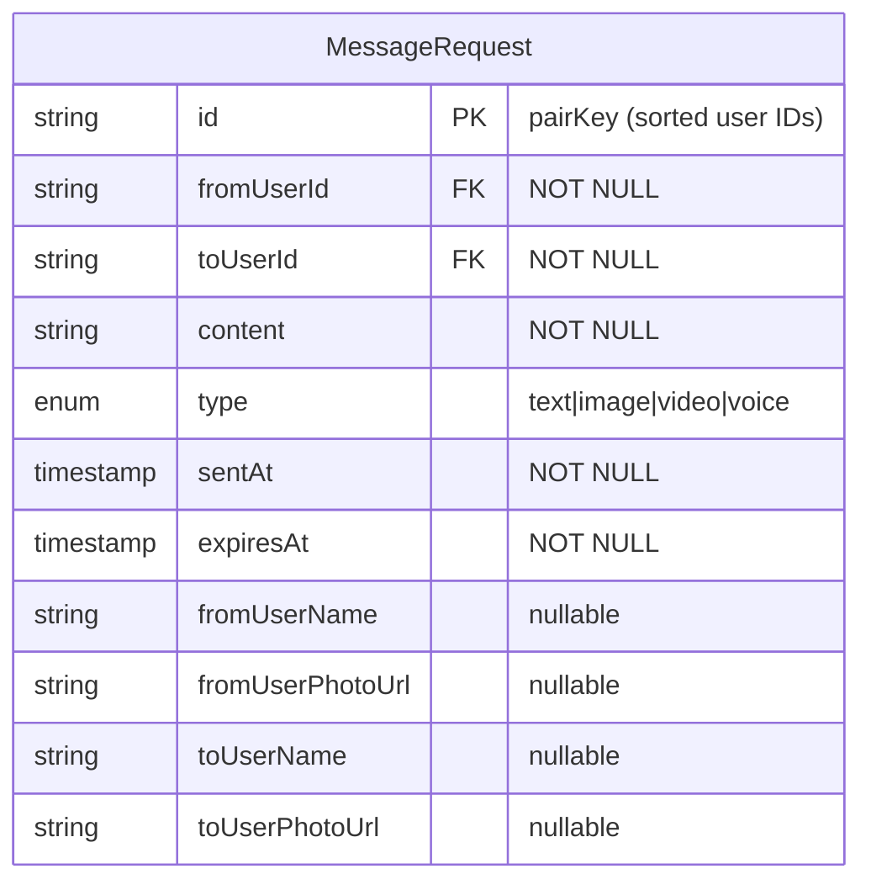

### 3.10 Like Entity

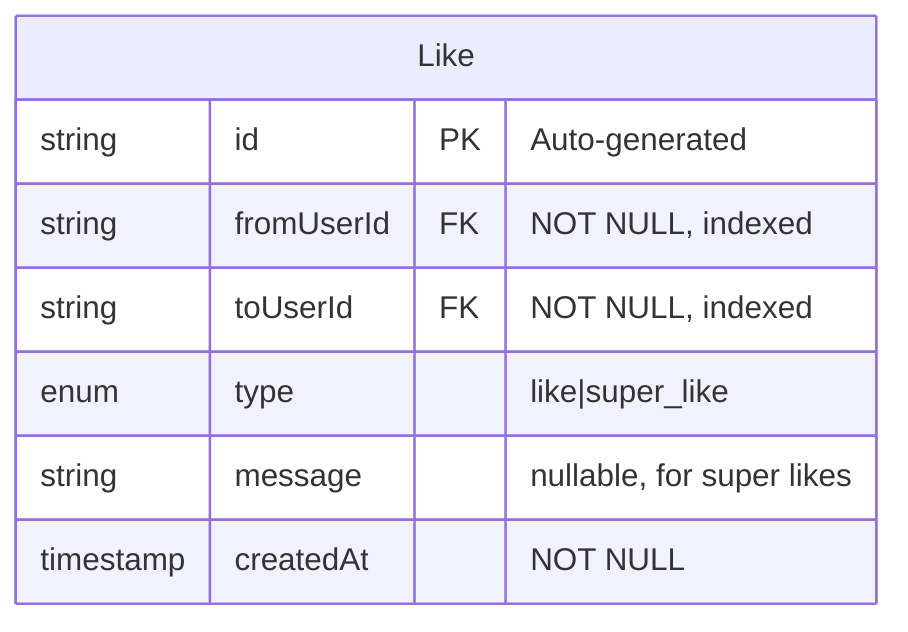

### 3.11 Swipe Entity

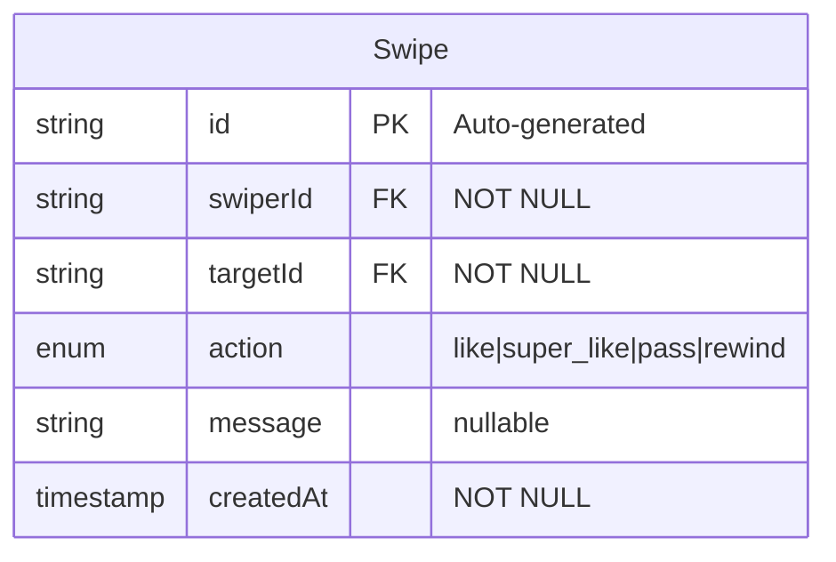

### 3.12 Block Entity

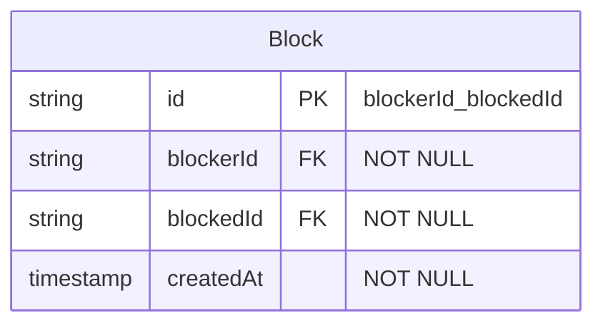

### 3.13 Report Entity

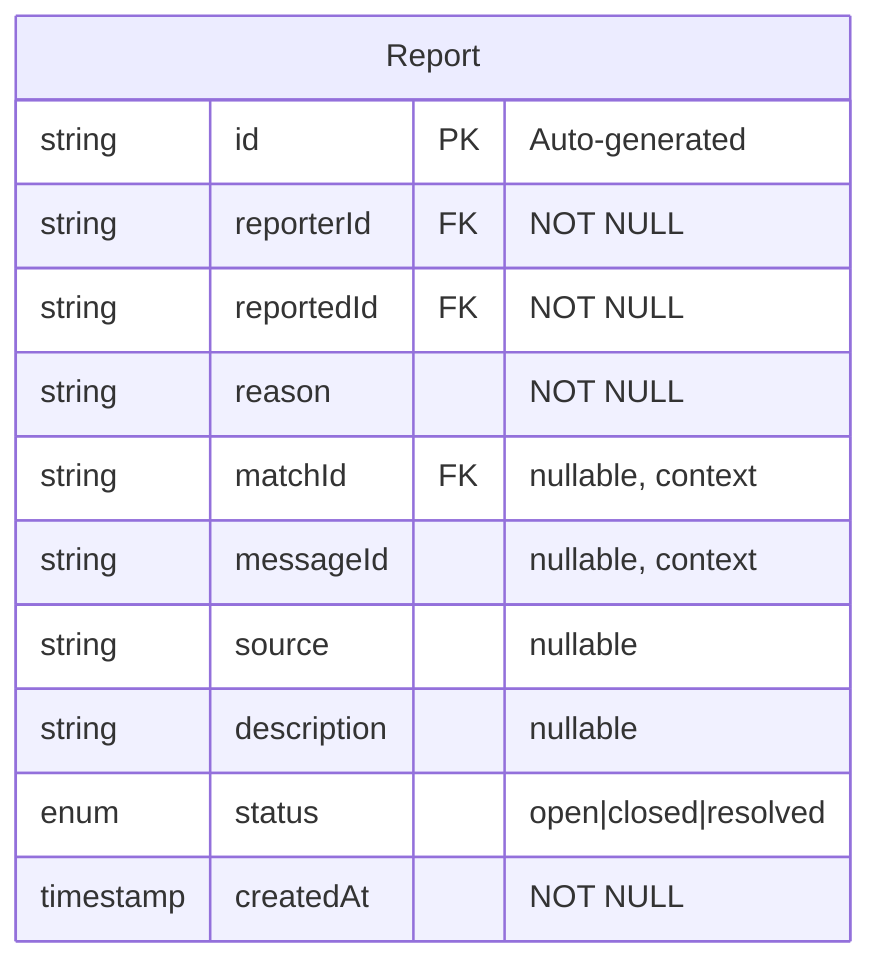

### 3.14 PhotoVerification Entity

```mermaid
erDiagram
    PhotoVerification {
        string userId PK_FK "NOT NULL"
        enum status "unverified|pending|verified|rejected|expired"
        timestamp submittedAt "nullable"
        timestamp verifiedAt "nullable"
        string selfieUrl "nullable"
        enum poseType "neutral|smiling|thumbsUp|peace|waving|pointingUp"
        double confidenceScore "0.0-1.0, MIN 0.85"
        string rejectionReason "nullable"
        int attempts "DEFAULT 0, MAX 3 per day"
    }
```

### 3.15 Call Entity

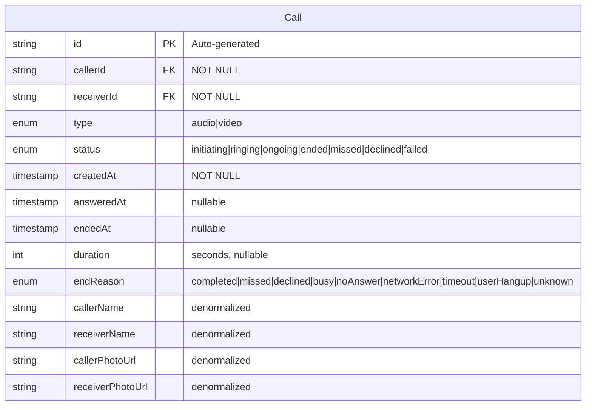

### 3.16 ProfileInsights Entity

```mermaid
erDiagram
    ProfileInsights {
        string userId PK_FK "NOT NULL"
        timestamp periodStart "NOT NULL"
        timestamp periodEnd "NOT NULL"
        int profileViews "DEFAULT 0"
        int likesReceived "DEFAULT 0"
        int likesSent "DEFAULT 0"
        int superLikesReceived "DEFAULT 0"
        double matchRate "0.0-1.0"
        double responseRate "0.0-1.0"
        int averageResponseTimeMinutes "nullable"
        int peakActivityHour "0-23, nullable"
        array topPhotosViewed "photo indices"
        map demographicBreakdown "nested"
        array weeklyTrend "nested DailyMetric array"
    }
```

### 3.17 WeeklyPicks Entity

```mermaid
erDiagram
    WeeklyPicks {
        string userId PK_FK "NOT NULL"
        timestamp weekStart "NOT NULL"
        timestamp weekEnd "NOT NULL"
        array picks "nested WeeklyPick, MAX 10"
        array viewedPicks "pick IDs"
        array likedPicks "pick IDs"
        timestamp refreshedAt "nullable"
    }

    WeeklyPick {
        string id "NOT NULL"
        string profileId FK "NOT NULL"
        enum reason "topPick|sharedInterests|nearbyLocation|highCompatibility|newToArea|popularProfile|similarLifestyle|educationMatch|relationshipGoalsMatch"
        int matchScore "0-100, nullable"
        array commonInterests "nullable"
        int highlightedPromptIndex "nullable"
    }
```

### 3.18 DailyLikesLimit Entity

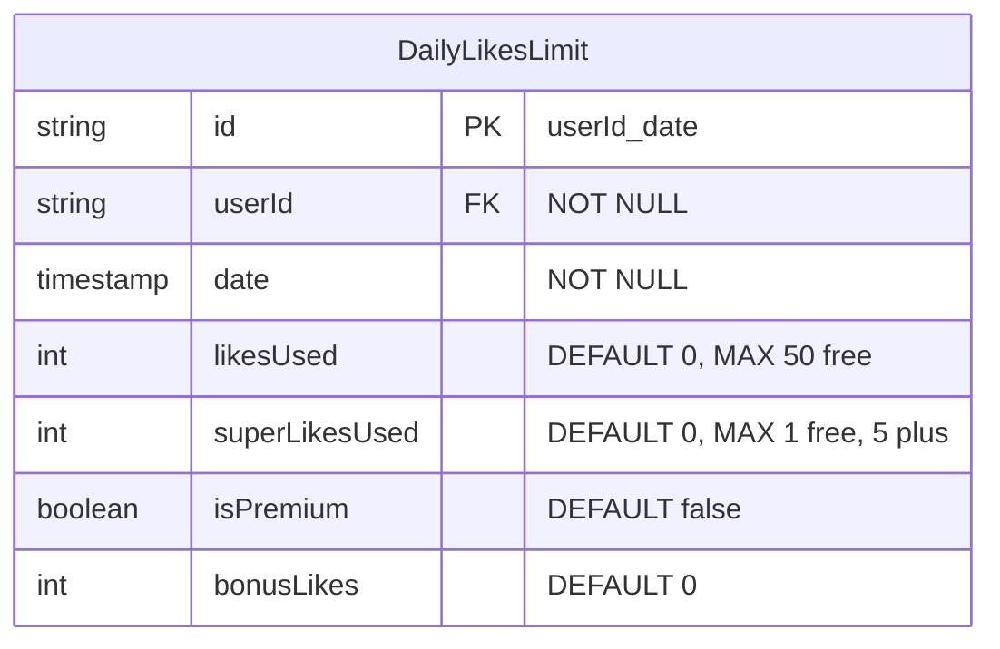

### 3.19 LikePriority Entity

```mermaid
erDiagram
    LikePriority {
        string likeId PK_FK "NOT NULL"
        string fromUserId FK "NOT NULL"
        string toUserId FK "NOT NULL"
        enum priority "standard|premium|platinum|spotlight"
        timestamp createdAt "NOT NULL"
        boolean boosted "DEFAULT false"
        boolean superLike "DEFAULT false"
        timestamp expiresAt "nullable"
    }
```

### 3.20 DatePlan Entity

```mermaid
erDiagram
    DatePlan {
        string id PK "Auto-generated"
        string userId FK "NOT NULL"
        string matchId FK "NOT NULL"
        string matchName "NOT NULL"
        string matchPhotoUrl "nullable"
        timestamp dateTime "NOT NULL"
        string location "NOT NULL"
        string locationAddress "nullable"
        double locationLatitude "nullable"
        double locationLongitude "nullable"
        string notes "nullable"
        array sharedWith "nested EmergencyContact array"
        timestamp createdAt "NOT NULL"
        timestamp checkInTime "nullable"
        timestamp checkedInAt "nullable"
        enum status "scheduled|ongoing|completed|cancelled|emergency"
    }
```

### 3.21 EmergencyContact Entity (Nested)

```mermaid
erDiagram
    EmergencyContact {
        string name "NOT NULL"
        string phone "NOT NULL"
        string email "nullable"
        string relationship "nullable"
        boolean notifyBySms "DEFAULT true"
        boolean notifyByEmail "DEFAULT false"
    }
```

### 3.22 CompatibilityQuiz Entity

```mermaid
erDiagram
    CompatibilityQuiz {
        string id PK "NOT NULL"
        string title "NOT NULL"
        string description "NOT NULL"
        array questions "nested QuizQuestion array"
        enum category "general|romance|lifestyle|coreValues|communication|future"
        int estimatedMinutes "DEFAULT 5"
        string imageUrl "nullable"
    }

    QuizQuestion {
        string id "NOT NULL"
        string question "NOT NULL"
        array options "nested QuizOption array"
        string emoji "nullable"
        enum category "lifestyle|coreValues|communication|intimacy|family|career|leisure"
    }

    QuizOption {
        string id "NOT NULL"
        string text "NOT NULL"
        string emoji "nullable"
        int value "nullable, for scoring"
    }
```

### 3.23 QuizResult Entity

```mermaid
erDiagram
    QuizResult {
        string id PK "Auto-generated"
        string quizId FK "NOT NULL"
        string user1Id FK "NOT NULL"
        string user2Id FK "NOT NULL"
        map user1Answers "questionId to optionId"
        map user2Answers "questionId to optionId"
        timestamp completedAt "NOT NULL"
        int overallScore "0-100, nullable"
        map categoryScores "category to score"
        array insights "nested CompatibilityInsight array"
    }
```

### 3.24 ProfileReaction Entity

```mermaid
erDiagram
    ProfileReaction {
        string id PK "Auto-generated"
        string fromUserId FK "NOT NULL"
        string toUserId FK "NOT NULL"
        enum contentType "photo|video|prompt|bio|interest"
        int contentIndex "NOT NULL"
        string reactionType "NOT NULL"
        timestamp createdAt "NOT NULL"
        string comment "nullable"
        string contentPreview "nullable"
        boolean isRead "DEFAULT false"
    }
```

### 3.25 ProfileStory Entity

```mermaid
erDiagram
    ProfileStory {
        string id PK "Auto-generated"
        string userId FK "NOT NULL"
        string mediaUrl "NOT NULL"
        enum mediaType "photo|video"
        timestamp createdAt "NOT NULL"
        timestamp expiresAt "DEFAULT createdAt plus 24h"
        int viewCount "DEFAULT 0"
        string thumbnailUrl "nullable, for videos"
    }
```

### 3.26 Presence Entity

```mermaid
erDiagram
    Presence {
        string userId PK_FK "NOT NULL"
        boolean isOnline "DEFAULT false"
        timestamp lastSeen
    }
```

---

## 4) Physical ER Diagram (Level 3)

### 4.1 Firestore Collection Tree

```
firestore/
│
├── users/{uid}                           # Main user document (26 collections total)
│   ├── id: string
│   ├── phoneNumber: string
│   ├── email: string | null
│   ├── emailLower: string | null
│   ├── username: string | null
│   ├── usernameLower: string | null
│   ├── isEmailVerified: boolean
│   ├── emailVerifiedViaOtp: boolean
│   ├── isPhoneVerified: boolean
│   ├── isIdVerified: boolean             # SERVER-ONLY WRITE
│   ├── isDeveloper: boolean
│   ├── plan: string                      # SERVER-ONLY WRITE ("free" | "plus")
│   ├── hasAcceptedTerms: boolean
│   ├── hasSkippedBasicInfo: boolean
│   ├── hasSkippedProfileSetup: boolean
│   ├── isDeactivated: boolean
│   ├── isPendingDeletion: boolean
│   ├── stripeCustomerId: string | null
│   ├── boost: map {
│   │   ├── expiresAt: number (ms)
│   │   └── activatedAt: timestamp
│   │ }
│   ├── safetyFlags: map {
│   │   ├── openReports: number
│   │   ├── lastReportAt: timestamp
│   │   ├── lastReason: string
│   │   ├── status: string ("watch" | "needs_review")
│   │   ├── appealOpen: boolean
│   │   └── lastAppealAt: timestamp
│   │ }
│   ├── createdAt: timestamp
│   ├── updatedAt: timestamp
│   └── profile: map {                    # NESTED PROFILE DOCUMENT
│       ├── name: string
│       ├── age: number
│       ├── gender: string
│       ├── sexualOrientation: string | null
│       ├── dateOfBirth: timestamp | null
│       ├── lastDobChangeAt: timestamp | null
│       ├── lastNameChangeAt: timestamp | null
│       ├── bio: string
│       ├── photoUrls: array<string>
│       ├── videoUrls: array<string>
│       ├── primaryPhotoIndex: number
│       ├── interests: array<string>
│       ├── profilePrompts: array<map> [
│       │   { questionId: string, answer: string, createdAt: timestamp }
│       │ ]
│       ├── heightCm: number | null
│       ├── relationshipGoals: string | null
│       ├── languages: array<string>
│       ├── zodiacSign: string | null
│       ├── educationLevel: string | null
│       ├── familyPlans: string | null
│       ├── personalityType: string | null
│       ├── religion: string | null
│       ├── workout: string | null
│       ├── socialMedia: string | null
│       ├── sleepingHabits: string | null
│       ├── smoking: string | null
│       ├── drinking: string | null
│       ├── diet: string | null
│       ├── pets: string | null
│       ├── jobTitle: string | null
│       ├── company: string | null
│       ├── school: string | null
│       ├── country: string
│       ├── city: string
│       ├── livingIn: string | null
│       ├── latitude: number | null
│       ├── longitude: number | null
│       ├── favoriteSongs: array<string>
│       ├── favoriteSinger: string | null
│       ├── isVerified: boolean
│       ├── isActive: boolean
│       ├── createdAt: timestamp | null
│       │
│       ├── preferences: map {            # NESTED PREFERENCES
│       │   ├── minAge: number
│       │   ├── maxAge: number
│       │   ├── maxDistanceKm: number
│       │   ├── showMeGenders: array<string>
│       │   ├── showMyDistance: boolean
│       │   ├── showMyAge: boolean
│       │   ├── hideFromDiscovery: boolean
│       │   ├── incognitoMode: boolean
│       │   ├── country: string
│       │   ├── city: string
│       │   ├── passportModeEnabled: boolean
│       │   ├── passportLocation: string | null
│       │   ├── passportLatitude: number | null
│       │   ├── passportLongitude: number | null
│       │   └── localDeckExhausted: boolean
│       │ }
│       │
│       ├── privacySettings: map {        # NESTED PRIVACY
│       │   ├── showAge: boolean
│       │   ├── showDateOfBirth: boolean
│       │   ├── showEmail: boolean
│       │   ├── showPhoneNumber: boolean
│       │   ├── showExactLocation: boolean
│       │   ├── showHeight: boolean
│       │   ├── showZodiacSign: boolean
│       │   ├── showEducation: boolean
│       │   ├── showFamilyPlans: boolean
│       │   ├── showPersonality: boolean
│       │   ├── showReligion: boolean
│       │   ├── showRelationshipGoals: boolean
│       │   ├── showWorkout: boolean
│       │   ├── showSmoking: boolean
│       │   ├── showDrinking: boolean
│       │   ├── showDiet: boolean
│       │   ├── showSleepingHabits: boolean
│       │   ├── showPets: boolean
│       │   ├── showJobTitle: boolean
│       │   ├── showCompany: boolean
│       │   ├── showSchool: boolean
│       │   ├── showFavoriteSongs: boolean
│       │   ├── showFavoriteSinger: boolean
│       │   ├── showSocialMedia: boolean
│       │   ├── showLanguages: boolean
│       │   ├── showOnlineStatus: boolean
│       │   └── showLastActive: boolean
│       │ }
│       │
│       └── favourites: map {             # NESTED FAVOURITES
│           ├── athlete: string | null
│           ├── food: string | null
│           ├── sport: string | null
│           ├── tvShow: string | null
│           ├── actor: string | null
│           ├── singer: string | null
│           ├── movie: string | null
│           ├── book: string | null
│           ├── hobby: string | null
│           └── travelDestination: string | null
│         }
│     }
│
├── usernames/{usernameLower}             # SERVER-ONLY (Username Index)
│   ├── uid: string
│   └── createdAt: timestamp
│
├── matches/{matchId}                     # Match Documents
│   ├── userIds: array<string>            # [uid1, uid2]
│   ├── status: string
│   ├── matchedAt: timestamp
│   ├── createdAt: timestamp
│   ├── lastMessageAt: timestamp | null
│   ├── mediaSendingEnabled: boolean
│   ├── pinnedBy: array<string>
│   ├── readBy: map<string, timestamp>
│   ├── preMatchMessageRequestsCount: number
│   ├── otherUserName: string | null
│   ├── otherUserPhotoUrl: string | null
│   │
│   ├── messages/{messageId}              # SUBCOLLECTION
│   │   ├── matchId: string
│   │   ├── fromUserId: string
│   │   ├── toUserId: string
│   │   ├── content: string
│   │   ├── type: string
│   │   ├── sentAt: timestamp
│   │   ├── isRead: boolean
│   │   ├── isDeletedForSender: boolean
│   │   ├── deletedFor: array<string>
│   │   ├── reactions: map<string, string>
│   │   ├── moderationStatus: string | null
│   │   ├── moderationReason: string | null
│   │   ├── moderationAction: string | null
│   │   └── isFlagged: boolean
│   │
│   └── typing/{userId}                   # SUBCOLLECTION (Typing Indicators)
│       └── timestamp: timestamp
│
├── likes/{likeId}                        # Like Records
│   ├── fromUserId: string
│   ├── toUserId: string
│   ├── type: string
│   ├── message: string | null
│   └── createdAt: timestamp
│
├── swipes/{swipeId}                      # Swipe History
│   ├── swiperId: string
│   ├── targetId: string
│   ├── action: string
│   ├── message: string | null
│   └── createdAt: timestamp
│
├── blocks/{blockId}                      # Block Records
│   ├── blockerId: string
│   ├── blockedId: string
│   └── createdAt: timestamp
│
├── reports/{reportId}                    # Report Records
│   ├── reporterId: string
│   ├── reportedId: string
│   ├── reason: string
│   ├── matchId: string | null
│   ├── messageId: string | null
│   ├── description: string | null
│   ├── source: string | null
│   ├── status: string
│   └── createdAt: timestamp
│
├── presence/{userId}                     # Online Presence
│   ├── isOnline: boolean
│   └── lastSeen: timestamp
│
├── message_requests/{pairKey}           # Pre-Match Message Requests
│   ├── fromUserId: string
│   ├── toUserId: string
│   ├── content: string
│   ├── type: string
│   ├── sentAt: timestamp
│   ├── expiresAt: timestamp
│   ├── fromUserName: string | null
│   ├── fromUserPhotoUrl: string | null
│   ├── toUserName: string | null
│   └── toUserPhotoUrl: string | null
│
├── notifications/{notificationId}        # Push Notification Queue
│   ├── userId: string
│   ├── title: string
│   ├── message: string
│   ├── type: string
│   ├── channels: map
│   ├── status: string
│   └── createdAt: timestamp
│
├── subscription_plans/{planId}           # Subscription Configuration
│   ├── name: string
│   ├── priceMonthly: number
│   ├── priceYearly: number | null
│   ├── features: array<string>
│   ├── stripePriceIdMonthly: string
│   └── stripePriceIdYearly: string | null
│
├── rateLimits/{limitKey}                 # Action Rate Limiting
│   ├── count: number
│   └── resetAt: timestamp
│
│ ══════════════════════════════════════════════════════════════════
│ SERVER-ONLY COLLECTIONS (No client read/write access)
│ ══════════════════════════════════════════════════════════════════
│
├── auth_email_otps/{otpId}              # Email OTP Storage
│   ├── identifierHash: string
│   ├── otp: string (bcrypt)
│   ├── purpose: string
│   ├── expiresAt: number
│   ├── verified: boolean
│   └── createdAt: timestamp
│
├── auth_credentials/{uid}               # Password Hashes
│   ├── passwordHash: string (bcrypt)
│   └── createdAt: timestamp
│
├── auth_password_resets/{resetId}       # Password Reset Tokens
│   ├── identifierHash: string
│   ├── resetToken: string (bcrypt)
│   ├── expiresAt: number
│   └── createdAt: timestamp
│
├── auth_rate_limits/{key}               # Auth Rate Limiting
│   ├── count: number
│   └── resetAt: timestamp
│
├── auth_audit_logs/{logId}              # Security Audit Trail
│   ├── action: string
│   ├── status: string
│   ├── identifierHash: string
│   ├── uid: string | null
│   ├── ip: string | null
│   ├── userAgent: string | null
│   ├── metadata: map
│   └── createdAt: timestamp
│
├── phone_verifications/{verificationId} # Phone OTP
│   ├── phoneNumber: string
│   ├── otp: string (bcrypt)
│   ├── expiresAt: number
│   ├── verified: boolean
│   └── createdAt: timestamp
│
├── phone_deletions/{deletionId}         # Scheduled Phone Deletions
│   ├── userId: string
│   ├── phoneNumber: string
│   ├── scheduledDeletionAt: timestamp
│   ├── status: string
│   └── createdAt: timestamp
│
├── phone_cooldowns/{phoneNumber}        # Phone Cooldown Tracking
│   ├── phoneNumber: string
│   ├── previousUserId: string
│   ├── availableAt: timestamp
│   └── createdAt: timestamp
│
├── account_events/{eventId}             # Account Activity Log
│   ├── userId: string
│   ├── eventType: string
│   └── createdAt: timestamp
│
├── account_deactivations/{deactivationId}  # Deactivation Records
│   ├── userId: string
│   ├── reason: string
│   ├── deactivatedAt: timestamp
│   ├── scheduledDeletionAt: timestamp
│   └── status: string
│
├── account_deletions/{deletionId}       # Deletion Records
│   ├── userId: string
│   ├── email: string
│   ├── reason: string
│   ├── requestedAt: timestamp
│   ├── scheduledDeletionAt: timestamp
│   └── status: string
│
├── automatedFlags/{flagId}              # Automated Safety Flags
│   ├── userId: string
│   ├── reason: string
│   ├── reportCount: number
│   ├── status: string
│   └── createdAt: timestamp
│
└── appeals/{appealId}                   # User Appeals
    ├── userId: string
    ├── reason: string
    ├── targetType: string
    ├── targetId: string | null
    ├── status: string
    └── createdAt: timestamp
```

### 4.2 Physical Mermaid Diagram

```mermaid
erDiagram
    %% ═══════════════════════════════════════════════════════════════
    %% USERS COLLECTION
    %% ═══════════════════════════════════════════════════════════════
    USERS {
        string _id PK "Firebase UID"
        string phoneNumber
        string email
        string username
        boolean isEmailVerified
        boolean isPhoneVerified
        boolean isIdVerified "SERVER-ONLY"
        string plan "SERVER-ONLY"
        boolean hasAcceptedTerms
        boolean hasSkippedBasicInfo
        boolean hasSkippedProfileSetup
        timestamp createdAt
        timestamp updatedAt
        map profile "nested document"
    }

    %% ═══════════════════════════════════════════════════════════════
    %% MATCHES COLLECTION
    %% ═══════════════════════════════════════════════════════════════
    MATCHES {
        string _id PK
        array userIds "indexed"
        string status "indexed"
        timestamp matchedAt "indexed"
        timestamp lastMessageAt
        array pinnedBy
        number preMatchMessageRequestsCount
        boolean mediaSendingEnabled
    }

    MESSAGES {
        string _id PK
        string matchId FK "parent doc"
        string fromUserId FK
        string toUserId FK
        string content
        string type
        timestamp sentAt "indexed"
        boolean isRead
        map reactions
        boolean isFlagged
    }

    TYPING {
        string _userId PK
        timestamp timestamp
    }

    %% ═══════════════════════════════════════════════════════════════
    %% DISCOVERY COLLECTIONS
    %% ═══════════════════════════════════════════════════════════════
    LIKES {
        string _id PK
        string fromUserId FK "indexed"
        string toUserId FK "indexed"
        string type
        timestamp createdAt "indexed"
    }

    SWIPES {
        string _id PK
        string swiperId FK
        string targetId FK
        string action
        timestamp createdAt
    }

    %% ═══════════════════════════════════════════════════════════════
    %% SAFETY COLLECTIONS
    %% ═══════════════════════════════════════════════════════════════
    BLOCKS {
        string _id PK
        string blockerId FK
        string blockedId FK
        timestamp createdAt
    }

    REPORTS {
        string _id PK
        string reporterId FK
        string reportedId FK
        string reason
        string status
        timestamp createdAt
    }

    %% ═══════════════════════════════════════════════════════════════
    %% PRESENCE
    %% ═══════════════════════════════════════════════════════════════
    PRESENCE {
        string _userId PK
        boolean isOnline
        timestamp lastSeen
    }

    %% ═══════════════════════════════════════════════════════════════
    %% RELATIONSHIPS
    %% ═══════════════════════════════════════════════════════════════
    USERS ||--o{ MATCHES : "participates via userIds"
    MATCHES ||--|{ MESSAGES : "contains subcollection"
    MATCHES ||--|{ TYPING : "contains subcollection"
    USERS ||--o{ LIKES : "sends fromUserId"
    USERS ||--o{ LIKES : "receives toUserId"
    USERS ||--o{ SWIPES : "performs"
    USERS ||--o{ BLOCKS : "creates"
    USERS ||--o{ REPORTS : "files"
    USERS ||--|| PRESENCE : "has"
    MESSAGES }o--|| USERS : "from"
    MESSAGES }o--|| USERS : "to"
```

---

## 5) Indexing Strategy

### 5.1 Composite Indexes Required

| Collection | Fields | Query Pattern |
|------------|--------|---------------|
| `matches` | userIds (array-contains), status, matchedAt (desc) | Fetch user's matches |
| `matches` | userIds (array-contains), lastMessageAt (desc) | Chat list sorted by recent |
| `messages` | sentAt (asc) | Message history |
| `messages` | sentAt (desc) | Latest messages first |
| `likes` | toUserId, createdAt (desc) | "Who Liked Me" screen |
| `likes` | fromUserId, createdAt (desc) | Like history |
| `reports` | status, createdAt (desc) | Admin moderation queue |

### 5.2 Single Field Indexes

| Collection | Field | Purpose |
|------------|-------|---------|
| `users` | profile.preferences.hideFromDiscovery | Discovery filtering |
| `users` | profile.latitude | Geo queries |
| `users` | profile.longitude | Geo queries |
| `users` | plan | Subscription filtering |
| `likes` | toUserId | Fast lookup of received likes |
| `message_requests` | fromUserId | Sent request lookup |
| `message_requests` | toUserId | Received request lookup |

### 5.3 Index Configuration (firestore.indexes.json)

```json
{
  "indexes": [
    {
      "collectionGroup": "matches",
      "queryScope": "COLLECTION",
      "fields": [
        { "fieldPath": "userIds", "arrayConfig": "CONTAINS" },
        { "fieldPath": "status", "order": "ASCENDING" },
        { "fieldPath": "matchedAt", "order": "DESCENDING" }
      ]
    },
    {
      "collectionGroup": "matches",
      "queryScope": "COLLECTION",
      "fields": [
        { "fieldPath": "userIds", "arrayConfig": "CONTAINS" },
        { "fieldPath": "lastMessageAt", "order": "DESCENDING" }
      ]
    },
    {
      "collectionGroup": "messages",
      "queryScope": "COLLECTION_GROUP",
      "fields": [
        { "fieldPath": "sentAt", "order": "ASCENDING" }
      ]
    },
    {
      "collectionGroup": "likes",
      "queryScope": "COLLECTION",
      "fields": [
        { "fieldPath": "toUserId", "order": "ASCENDING" },
        { "fieldPath": "createdAt", "order": "DESCENDING" }
      ]
    },
    {
      "collectionGroup": "likes",
      "queryScope": "COLLECTION",
      "fields": [
        { "fieldPath": "fromUserId", "order": "ASCENDING" },
        { "fieldPath": "createdAt", "order": "DESCENDING" }
      ]
    },
    {
      "collectionGroup": "reports",
      "queryScope": "COLLECTION",
      "fields": [
        { "fieldPath": "status", "order": "ASCENDING" },
        { "fieldPath": "createdAt", "order": "DESCENDING" }
      ]
    }
  ]
}
```

---

## 6) Security Rules Summary

### 6.1 Access Control Matrix

| Collection | Client Read | Client Create | Client Update | Client Delete |
|------------|-------------|---------------|---------------|---------------|
| `users` | Signed-in | Owner only | Owner (except protected) | No |
| `usernames` | No | No | No | No |
| `matches` | Participants | No (Cloud Functions) | No | No |
| `messages` | Participants | Verified users | Receiver (mark read) | No |
| `message_requests` | Participants | Sender only | No | Participants |
| `likes` | Signed-in | Owner (fromUserId) | No | No |
| `swipes` | No | Owner | No | No |
| `blocks` | No | Owner (blockerId) | No | No |
| `reports` | No | Owner (reporterId) | No | No |
| `presence` | Signed-in | Owner | Owner | No |
| `auth_*` | No | No | No | No |

### 6.2 Protected Fields (Server-Only Write)

| Collection | Field | Reason |
|------------|-------|--------|
| `users` | `plan` | Subscription managed by Stripe webhooks |
| `users` | `isIdVerified` | Verification managed by server |
| `users` | `safetyFlags` | Managed by moderation system |

### 6.3 Security Rules Code

```javascript
rules_version = '2';
service cloud.firestore {
  match /databases/{database}/documents {

    function isSignedIn() {
      return request.auth != null;
    }

    function isOwner(uid) {
      return isSignedIn() && request.auth.uid == uid;
    }

    // USERS
    match /users/{uid} {
      allow read: if isSignedIn();
      allow create: if isOwner(uid);
      allow update: if isOwner(uid)
        && !request.resource.data.diff(resource.data)
            .affectedKeys().hasAny(['plan', 'isIdVerified']);
      allow delete: if false;
    }

    // SERVER-ONLY COLLECTIONS
    match /usernames/{username} { allow read, write: if false; }
    match /auth_email_otps/{otpId} { allow read, write: if false; }
    match /auth_credentials/{uid} { allow read, write: if false; }
    match /auth_password_resets/{resetId} { allow read, write: if false; }
    match /auth_rate_limits/{key} { allow read, write: if false; }
    match /auth_audit_logs/{logId} { allow read, write: if false; }

    // MATCHES
    match /matches/{matchId} {
      allow read: if isSignedIn()
        && resource.data.userIds.hasAny([request.auth.uid]);
      allow create, update, delete: if false;

      match /messages/{messageId} {
        allow read: if isSignedIn()
          && get(/databases/$(database)/documents/matches/$(matchId))
              .data.userIds.hasAny([request.auth.uid]);
        allow create: if isSignedIn()
          && get(/databases/$(database)/documents/matches/$(matchId))
              .data.userIds.hasAll([request.auth.uid, request.resource.data.toUserId]);
        allow update: if isSignedIn()
          && resource.data.toUserId == request.auth.uid
          && request.resource.data.diff(resource.data).changedKeys().hasOnly(['isRead']);
        allow delete: if false;
      }
    }

    // LIKES
    match /likes/{likeId} {
      allow read: if isSignedIn();
      allow create: if isSignedIn()
        && request.resource.data.fromUserId == request.auth.uid;
      allow update, delete: if false;
    }

    // BLOCKS
    match /blocks/{blockId} {
      allow read: if false;
      allow create: if isSignedIn()
        && request.resource.data.blockerId == request.auth.uid;
      allow update, delete: if false;
    }

    // REPORTS
    match /reports/{reportId} {
      allow read: if false;
      allow create: if isSignedIn()
        && request.resource.data.reporterId == request.auth.uid;
      allow update, delete: if false;
    }
  }
}
```

---

## 7) Data Dictionary

### 7.1 User Domain Fields

| Field | Type | Constraints | Description |
|-------|------|-------------|-------------|
| `id` | string | PK, Firebase UID | Unique user identifier |
| `phoneNumber` | string | NOT NULL | Phone with country code |
| `email` | string | UNIQUE, nullable | Email address |
| `username` | string | UNIQUE, nullable | Display username |
| `isEmailVerified` | boolean | DEFAULT false | Email verification status |
| `isPhoneVerified` | boolean | DEFAULT false | Phone verification status |
| `isIdVerified` | boolean | SERVER-ONLY | ID/photo verification |
| `plan` | enum | SERVER-ONLY, free/plus | Subscription tier |
| `hasAcceptedTerms` | boolean | DEFAULT false | T&C acceptance |
| `profile.name` | string | NOT NULL | First name (private by default) |
| `profile.lastName` | string | nullable | Last name (private by default) |
| `profile.age` | int | MIN 18 | User's age |
| `profile.gender` | string | NOT NULL | Gender identity |
| `profile.bio` | string | MAX 500 | Profile bio |
| `profile.photoUrls` | array | MAX 6 | Profile photos |
| `profile.videoUrls` | array | MAX 2 | Profile videos |
| `profile.interests` | array | MAX 10 | Interest tags |
| `profile.profilePrompts` | array | MAX 3 | Q&A prompts |
| `profile.latitude` | double | nullable | Location latitude |
| `profile.longitude` | double | nullable | Location longitude |
| `profile.privacySettings.showFirstName` | boolean | DEFAULT false | Show first name publicly |
| `profile.privacySettings.showLastName` | boolean | DEFAULT false | Show last name publicly |

### 7.2 Match & Message Fields

| Field | Type | Constraints | Description |
|-------|------|-------------|-------------|
| `match.userIds` | array | 2 items | Participant user IDs |
| `match.status` | enum | pending/mutual/rejected/unmatched | Match state |
| `match.matchedAt` | timestamp | NOT NULL | When matched |
| `match.lastMessageAt` | timestamp | nullable | Last message time |
| `message.content` | string | NOT NULL | Message text or media URL |
| `message.type` | enum | text/image/video/voice | Message type |
| `message.sentAt` | timestamp | NOT NULL | Send timestamp |
| `message.isRead` | boolean | DEFAULT false | Read receipt |
| `message.reactions` | map | userId→emoji | Message reactions |
| `messageRequest.fromUserId` | string | NOT NULL | Request sender |
| `messageRequest.toUserId` | string | NOT NULL | Request recipient |
| `messageRequest.content` | string | NOT NULL | Request message content |
| `messageRequest.type` | enum | text/image/video/voice | Request message type |
| `messageRequest.sentAt` | timestamp | NOT NULL | Request sent time |
| `messageRequest.expiresAt` | timestamp | NOT NULL | Request expiration |

### 7.3 Discovery Fields

| Field | Type | Constraints | Description |
|-------|------|-------------|-------------|
| `like.fromUserId` | string | FK, NOT NULL | Who sent the like |
| `like.toUserId` | string | FK, NOT NULL | Who received the like |
| `like.type` | enum | like/super_like | Like type |
| `swipe.action` | enum | like/super_like/pass/rewind | Swipe action |
| `preferences.minAge` | int | DEFAULT 18 | Min age filter |
| `preferences.maxAge` | int | DEFAULT 50 | Max age filter |
| `preferences.maxDistanceKm` | double | DEFAULT 100 | Distance filter |
| `preferences.incognitoMode` | boolean | DEFAULT false | Hidden from others |

### 7.4 Safety Fields

| Field | Type | Constraints | Description |
|-------|------|-------------|-------------|
| `block.blockerId` | string | FK, NOT NULL | Who blocked |
| `block.blockedId` | string | FK, NOT NULL | Who was blocked |
| `report.reason` | string | NOT NULL | Report reason |
| `report.status` | enum | open/closed/resolved | Report status |
| `datePlan.location` | string | NOT NULL | Date location |
| `datePlan.sharedWith` | array | EmergencyContact[] | Safety contacts |

---

## 8) Relationship Matrix

| From Entity | To Entity | Relationship | Cardinality | Implementation |
|-------------|-----------|--------------|-------------|----------------|
| CrushUser | Profile | has | 1:1 | Nested map |
| Profile | ProfilePrompt | contains | 1:N (max 3) | Nested array |
| Profile | DiscoveryPreferences | has | 1:1 | Nested map |
| Profile | ProfilePrivacySettings | has | 1:1 | Nested map |
| Profile | ProfileFavourites | has | 1:1 | Nested map |
| CrushUser | CrushMatch | participates in | N:M | userIds array |
| CrushMatch | Message | contains | 1:N | Subcollection |
| CrushUser | Message | sends | 1:N | fromUserId FK |
| CrushUser | Message | receives | 1:N | toUserId FK |
| CrushUser | MessageRequest | sends | 1:N | fromUserId FK |
| CrushUser | MessageRequest | receives | 1:N | toUserId FK |
| CrushUser | Like | sends | 1:N | fromUserId FK |
| CrushUser | Like | receives | 1:N | toUserId FK |
| Like | LikePriority | has | 1:1 | Separate doc, same ID |
| CrushUser | Swipe | performs | 1:N | swiperId FK |
| CrushUser | Block | creates | 1:N | blockerId FK |
| CrushUser | Report | files | 1:N | reporterId FK |
| CrushUser | PhotoVerification | has | 1:1 | userId PK/FK |
| CrushUser | Call | initiates | 1:N | callerId FK |
| CrushUser | Call | receives | 1:N | receiverId FK |
| CrushUser | ProfileReaction | sends | 1:N | fromUserId FK |
| CrushUser | ProfileStory | posts | 1:N | userId FK |
| CrushUser | QuizResult | participates | N:M | user1Id, user2Id FKs |
| CompatibilityQuiz | QuizResult | produces | 1:N | quizId FK |
| CrushUser | ProfileInsights | has | 1:1 | userId PK/FK |
| CrushUser | Presence | has | 1:1 | userId PK/FK |
| CrushUser | WeeklyPicks | receives | 1:1 | userId PK/FK |
| CrushUser | DailyLikesLimit | has | 1:1 | userId in composite key |
| DatePlan | EmergencyContact | shared with | 1:N | Embedded array |

---

## Summary Statistics

| Metric | Count |
|--------|-------|
| Total Entities | 25 |
| Root Collections | 25 |
| Subcollections | 3 |
| Server-Only Collections | 9 |
| Nested Documents (Maps) | 6 |
| Total Fields | 200+ |
| Composite Indexes | 6 |
| Single Field Indexes | 5 |

---

## Notes

- **Nested vs Separate Collections**: Profile data is nested within users for atomic updates and single-read efficiency
- **Subcollections**: Messages use subcollections under matches for scalability (1M+ messages per match)
- **Server-Only Collections**: Auth and security collections are inaccessible to clients for security
- **Denormalization**: Match documents store `otherUserName` and `otherUserPhotoUrl` to avoid additional reads
- **Soft Deletes**: Account deletions use status flags rather than actual document deletion
- **Timestamps**: All use `serverTimestamp()` for consistency across time zones
- **Protected Fields**: `plan` and `isIdVerified` can only be modified by Cloud Functions
- **2026-02-23 Web update**: Discovery profile stories are represented as user-owned story documents with per-viewer view subdocuments for deduplicated view counts.
- **2026-03-08 Discovery refactor**: Story update lifecycle event types are domain-contract artifacts (`StoryRepository`) and no longer defined in discovery data service classes.
- **2026-03-08 Discovery refactor (matching engine):** No schema changes; discovery filtering/ranking rules are now implemented in a shared domain decision utility (`MatchingDecisionEngine`) instead of repository-local logic.
- **2026-03-08 Settings refactor (account commands):** No schema changes; account action orchestration (delete/deactivate/export/cancel-delete) moved behind typed settings command contracts for consistent failure handling.
- **2026-03-08 Settings refactor (preference sync):** Added additive notification preference metadata fields on user records (`notificationPrefs.quietHoursEnabled`, `notificationPrefsUpdatedAtMs`) to support timestamp-aware local/remote preference sync and explicit quiet-hours enablement.
- **2026-03-08 Store mobile checkout routing:** No schema changes; checkout entrypoint moved to repository-owned `purchasePlusPlan()` with native billing paths on iOS/Android and Stripe URL path disabled on mobile.
- **2026-03-08 Store Google server validation:** Added additive user subscription metadata maps (`googlePlayPurchase`, `subscriptionLifecycle`) to persist validated Google Play token/order linkage and lifecycle reconciliation snapshots.
- **2026-03-08 Store Google RTDN lifecycle:** No schema changes beyond additive metadata updates; RTDN events now refresh existing `googlePlayPurchase` and `subscriptionLifecycle` maps with notification type and lifecycle timestamps.
- **2026-03-08 Store Google restore + acknowledgement:** No schema changes; restore flow reuses existing `googlePlayPurchase`/`subscriptionLifecycle` fields while adding client-side acknowledgement completion and restored-token verification orchestration.
- **2026-03-08 Store Apple server validation:** Added additive user subscription metadata map (`applePurchase`) and provider-aware `subscriptionLifecycle` updates for App Store transaction validation (`verifyAppleTransaction`) while preserving existing `plan` compatibility.
- **2026-03-08 Store Apple restore compliance:** No schema changes; iOS restore now requires transaction-ID-backed validation through `verifyAppleTransaction`, reusing existing `applePurchase`/`subscriptionLifecycle` metadata fields for restored entitlement reconciliation.
- **2026-03-08 Store Apple S2S lifecycle:** No schema changes; App Store Server Notification events now update existing `applePurchase` and `subscriptionLifecycle` metadata fields with notification identifiers and lifecycle timestamps.
- **2026-03-12 Subscription entitlement gating:** No schema changes; premium feature checks now consume shared cached entitlement decisions and user-scoped local like-usage counters rather than adding new persisted data structures.
- **2026-03-12 Store receipt validation callable:** No schema changes; `verifyPurchaseReceipt` reuses the existing user-level subscription metadata fields (`plan`, `googlePlayPurchase`, `applePurchase`, `subscriptionLifecycle`) while unifying the mobile receipt-validation API surface.
- **2026-03-12 Store repository IAP contract:** No schema changes; the client-side subscription repositories now share a common product/purchase/restore/receipt API while continuing to read and write the existing user-level subscription metadata fields.
- **2026-03-12 Store bootstrap setup:** No schema changes; startup now primes a shared native billing service instance and records the iOS In-App Purchase capability at the Xcode project level.
- **2026-03-13 Discovery eligibility centralization:** No schema rewrite was introduced, but discovery now treats `users/{uid}` as a dual-shape compatibility source during migration: canonical nested `profile.*` remains the target write model, while legacy flat web fields (`displayName`, `photos`, `location`, `interestedIn`, root completion flags) are normalized into the same discovery snapshot before filtering.
- **2026-03-13 Discovery legacy-web compatibility:** No new collection was added; a server-side compatibility trigger now mirrors canonical nested discovery fields back onto the existing legacy flat fields in `users/{uid}` so stale Firestore-only web clients keep seeing newly eligible users during rollout.
