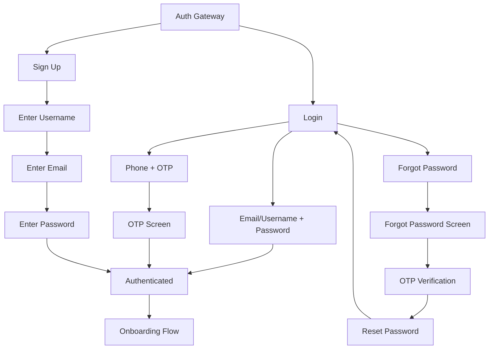
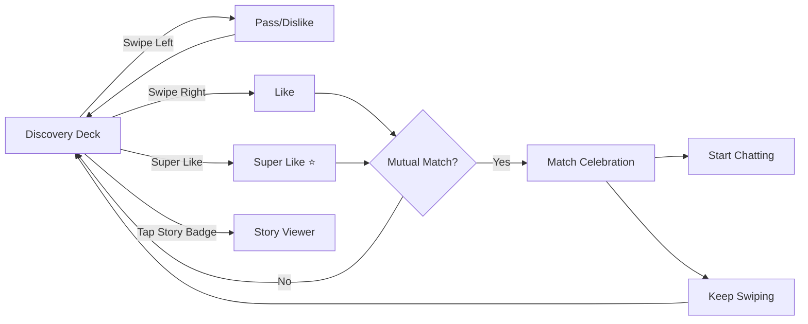
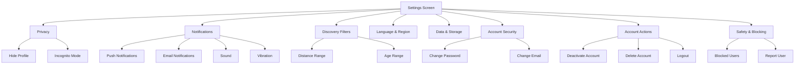
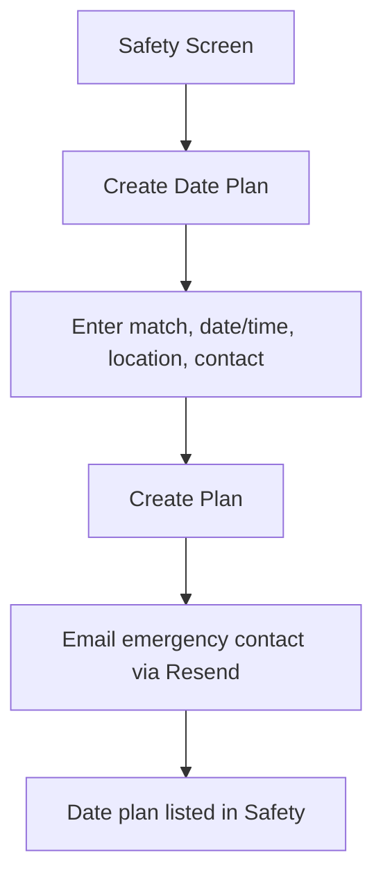
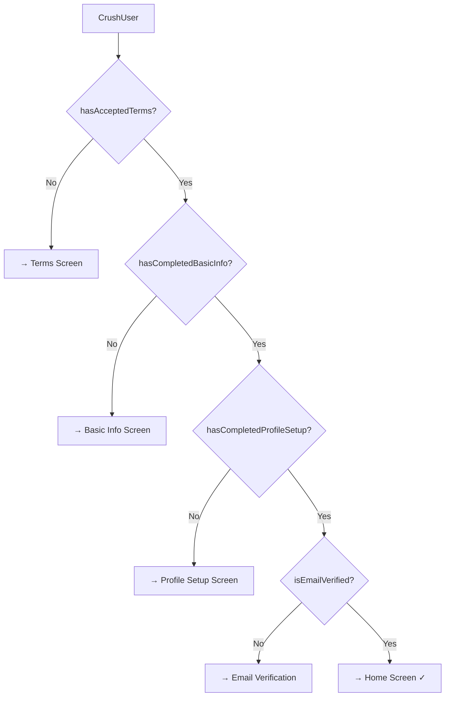
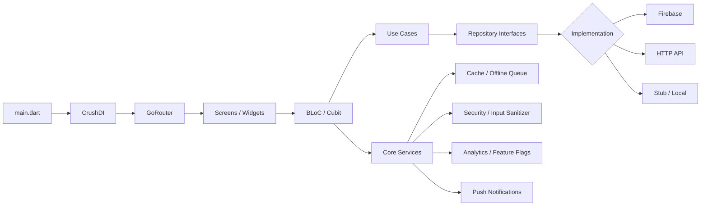
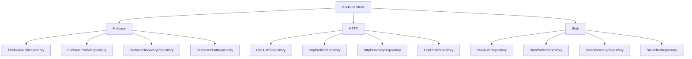

# Project Flowchart — CrushHour Dating App

*Last updated: 2026-01-20*

---

## 1) App Initialization Flow


---

## 2) Authentication Flow



---

## 3) Onboarding Flow (Sequential)

```mermaid
flowchart TD
  AUTH[Authenticated] --> T[Step 1: Terms & Conditions]
  T -->|Accept| BI[Step 2: Basic Info - 60%]
  BI --> ID[Step 3: ID Verification - 80%]
  ID -->|Optional| PS[Step 4: Profile Setup - 100%]
  PS --> EV{Email Verified?}
  EV -->|No| EVS[Email Verification Screen]
  EV -->|Yes| H[Home Screen]
  EVS --> H

  subgraph "Basic Info Fields"
    BI1[Username]
    BI2[First Name]
    BI3[Last Name]
    BI4[Name Visibility (private by default)]
    BI5[Date of Birth]
    BI6[Gender]
    BI7[Sexual Orientation]
  end

  subgraph "Profile Setup Fields"
    PS1[Photos]
    PS2[Bio]
    PS3[Location]
    PS4[Work & Education]
    PS5[Interests]
    PS6[Favorites]
  end
```

---

## 4) Home Screen - Bottom Navigation

```mermaid
flowchart TD
  H[Home Screen] --> T1[Tab 1: Discover]
  H --> T2[Tab 2: Matches]
  H --> T3[Tab 3: Chats]
  H --> T4[Tab 4: Profile]

  T1 --> D1[Swipe Deck]
  T1 --> D2[Weekly Picks]
  T1 --> D3[Likes You]

  T2 --> M0[Matches Screen]
  M0 --> M1[Matched With You]
  M0 --> M2[Likes You (Blurred)]
  M1 --> M3[Chat Screen]
  M2 --> M4[Upgrade to Plus]

  T3 --> C1[Conversations List]
  C1 --> C2[Chat Screen]
  C2 --> C3[Audio Call]
  C2 --> C4[Video Call]

  T4 --> P1[Profile View]
  P1 --> P2[Profile Edit]
  P1 --> P3[Profile Media]
  P1 --> P4[Settings]
```

---

## 5) Discovery Feature Flow



---

## 6) Settings Structure



---

## 7) Safety & Date Plan Flow



---

## 8) Complete Route Map

### Authentication Routes
| Route | Screen | Description |
|-------|--------|-------------|
| `/auth` | Auth Gateway | Entry point (login/signup options) |
| `/auth/login` | Login Screen | Email/username login |
| `/auth/signup` | Sign Up Screen | Multi-step registration |
| `/auth/otp` | OTP Screen | OTP verification |
| `/auth/forgot` | Forgot Password | Password recovery |
| `/auth/reset` | Reset Password | Set new password |
| `/auth/phone` | Phone Auth | Phone number login |
| `/auth/email` | Email Auth | Email link login |

### Onboarding Routes
| Route | Screen | Progress |
|-------|--------|----------|
| `/terms-conditions` | Terms & Conditions | Step 1 |
| `/basic-info` | Basic Info | Step 2 (60%) |
| `/id-verification` | ID Verification | Step 3 (80%) |
| `/profile-setup` | Profile Setup | Step 4 (100%) |
| `/email-verification` | Email Verification | Final check |

### Main App Routes
| Route | Screen | Description |
|-------|--------|-------------|
| `/home` | Home Screen | Bottom navigation hub |
| `/profile` | Profile View | User's own profile |
| `/profile/edit` | Profile Edit | Edit profile details |
| `/user-profile` | Other User Profile | View other profiles |
| `/chat/:matchId` | Chat Screen | Individual conversation |

### Discovery Routes
| Route | Screen | Description |
|-------|--------|-------------|
| `/likes-you` | Likes You | Profiles that liked user |
| `/weekly-picks` | Weekly Picks | Curated recommendations |
| `/date-ideas` | Date Ideas | Date suggestions |
| `/compatibility-quiz` | Compatibility Quiz | Match assessment |
| `/profile-insights` | Profile Insights | Analytics & stats |

### Settings Routes
| Route | Screen | Description |
|-------|--------|-------------|
| `/settings` | Settings Hub | Main settings |
| `/settings/privacy` | Privacy | Profile visibility |
| `/settings/notifications` | Notifications | Push, email, sound, vibration |
| `/settings/discovery` | Discovery Filters | Distance, age filters |
| `/settings/language` | Language & Region | Localization |
| `/settings/storage` | Data & Storage | Cache management |
| `/settings/security` | Account Security | Password, email |
| `/settings/account` | Account Actions | Delete, deactivate |

### Other Routes
| Route | Screen | Description |
|-------|--------|-------------|
| `/safety` | Safety | Safety settings & blocking |
| `/logout` | Logout | Logout confirmation |
| `/safety-guidelines` | Community Guidelines | Rules |
| `/privacy-policy` | Privacy Policy | Legal |
| `/terms-of-service` | Terms of Service | Legal |

---

## 8) User State Flags



| Flag | Description | Required For |
|------|-------------|--------------|
| `hasAcceptedTerms` | User accepted T&C | Basic Info access |
| `hasCompletedBasicInfo` | Basic info filled | Profile Setup access |
| `hasCompletedProfileSetup` | Profile complete | Main app access |
| `isEmailVerified` | Email verified | Full access |
| `isAccountVerified` | Phone OR email verified | Full access |

---

## 9) Architecture and Data Flow



---

## 10) Backend Modes (Runtime Switch)



---

## 11) Feature Modules

```
lib/features/
├── auth/                    → Authentication & Sign-up
├── discovery/               → Swiping, Likes You, Weekly Picks
├── chat/                    → Messaging & Matches
├── profile/                 → User Profile Management
├── settings/                → App Settings & Preferences
├── calls/                   → Video Calling (Agora)
├── social/                  → Date Ideas, Compatibility Quiz
├── analytics/               → Profile Insights & Stats
├── subscription/            → Premium/Plus Management
├── safety/                  → Safety & Blocking
├── verification/            → Email/Phone Verification
└── feature_flags/           → Feature Toggle Management
```

---

## 12) Summary Statistics

| Metric | Count |
|--------|-------|
| Total Screens | 50+ |
| Feature Modules | 12 |
| Onboarding Steps | 4-5 |
| Bottom Nav Tabs | 4 |
| Settings Sub-screens | 8 |
| Auth Methods | 3 (Email, Phone, Username) |
| Routes | 40+ |

---

## Notes

- **Onboarding gating order**: Terms → Basic Info → ID Verification (optional) → Profile Setup → Email Verification (if needed) → Home
- **ID Verification** is part of the onboarding UX but is not a hard gate in router redirects
- **Weekly Picks** route is accessible from all onboarding stages (special exception)
- **Safety** route is accessible from all onboarding stages (special exception)
- The router enforces auth state and onboarding status to prevent accessing protected routes when incomplete
- **Password change** triggers email notification to user for security
- **Notification settings** (Sound, Vibration, Email) sync to both local storage and Firestore
