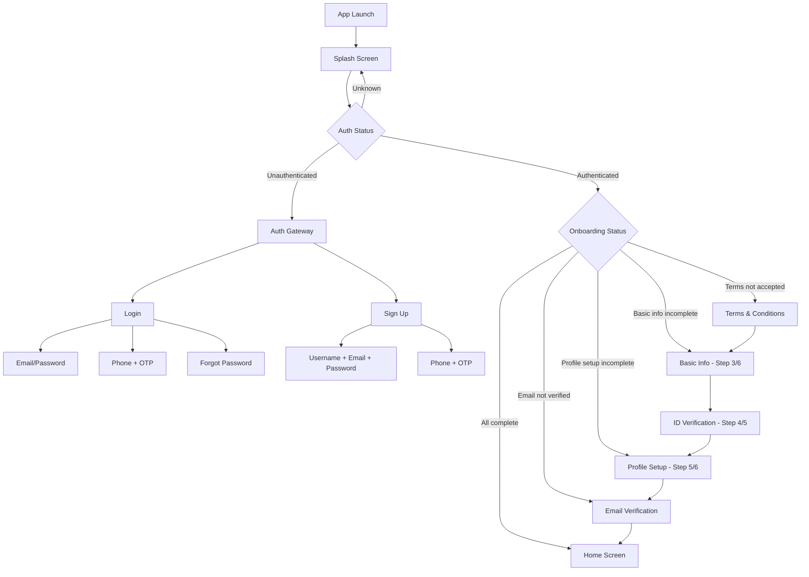
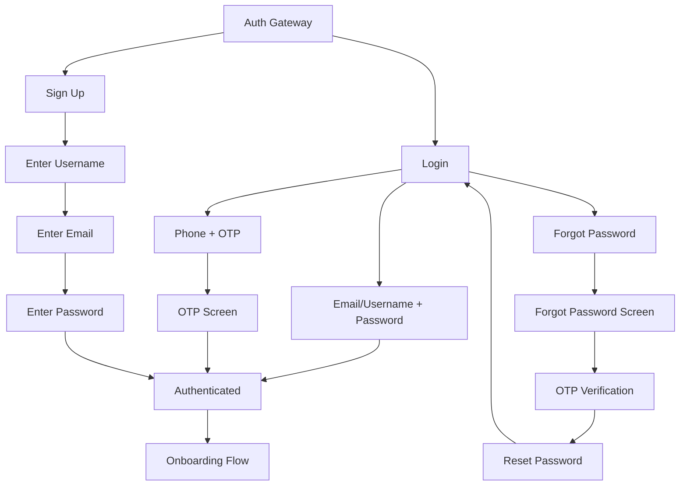
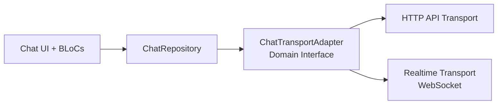
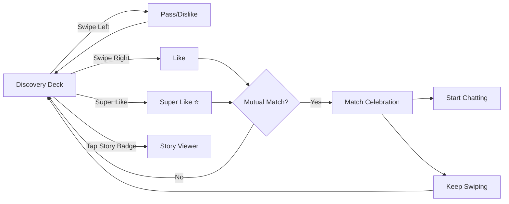
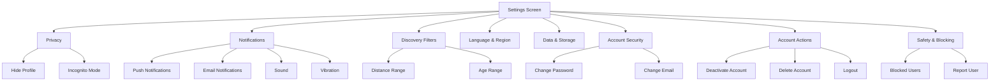
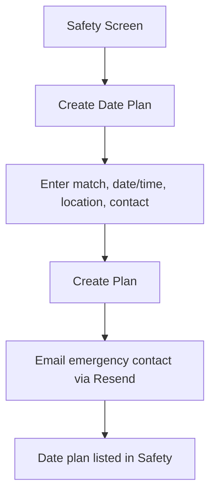
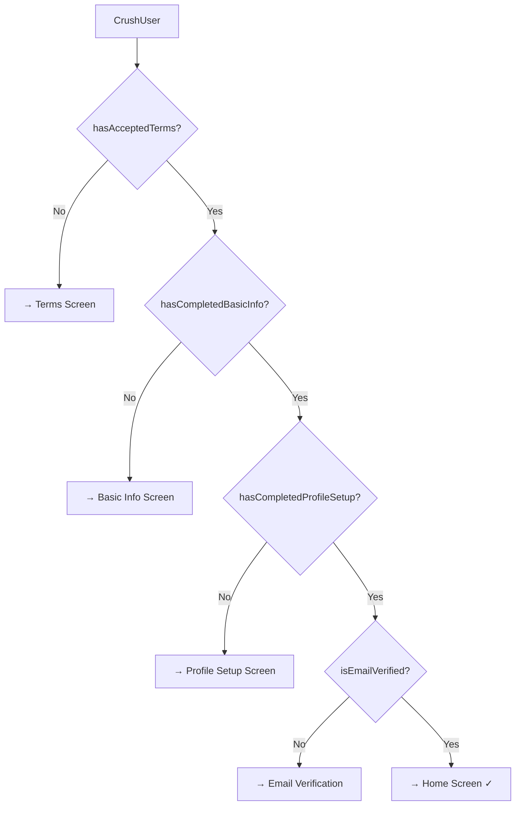
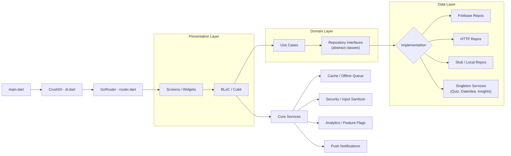
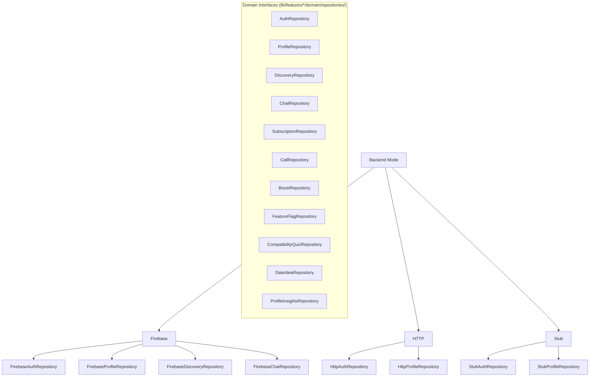

# Project Flowchart — CrushHour Dating App

*Last updated: 2026-03-08*

---

## 1) App Initialization Flow



---

## 2) Authentication Flow



---

## 3) Onboarding Flow (Sequential)

```mermaid
flowchart TD
  AUTH[Authenticated] --> T[Step 2: Terms & Conditions]
  T -->|Accept| BI[Step 3: Basic Info]
  BI --> ID[Step 4: ID Verification]
  ID -->|Optional| PS[Step 5: Profile Setup]
  PS --> EV{Step 6: Email Verified?}
  EV -->|No| EVS[Step 6: Email Verification Screen]
  EV -->|Yes| H[Home Screen]
  EVS --> H

  subgraph "Basic Info Fields"
    BI1[Username]
    BI2[First Name]
    BI3[Last Name]
    BI4[Name Visibility (private by default)]
    BI5[Date of Birth]
    BI6[Gender]
    BI7[Sexual Orientation]
  end

  subgraph "Profile Setup Fields"
    PS1[Photos]
    PS2[Bio]
    PS3[Location]
    PS4[Work & Education]
    PS5[Interests]
    PS6[Favorites]
  end
```

---

## 4) Home Screen - Bottom Navigation

```mermaid
flowchart TD
  H[Home Screen] --> T1[Tab 1: Discover]
  H --> T2[Tab 2: Matches]
  H --> T3[Tab 3: Chats]
  H --> T4[Tab 4: Profile]

  T1 --> D1[Swipe Deck]
  T1 --> D2[Weekly Picks]
  T1 --> D3[Likes You]

  T2 --> M0[Matches Screen]
  M0 --> M1[Matched With You]
  M0 --> M2[Likes You (Blurred)]
  M1 --> M3[Chat Screen]
  M2 --> M4[Upgrade to Plus]

  T3 --> C1[Conversations List]
  C1 --> MR[Message Requests]
  MR --> MRS[Message Requests Screen]
  C1 --> C2[Chat Screen]
  MRS --> C2
  C2 --> C3[Audio Call]
  C2 --> C4[Video Call]

  T4 --> P1[Profile View]
  P1 --> P2[Profile Edit]
  P1 --> P3[Profile Media]
  P1 --> P4[Settings]
```

---

## 4.1) Chat Transport Adapter Flow



---

## 5) Discovery Feature Flow



---

## 6) Settings Structure



---

## 7) Safety & Date Plan Flow



---

## 8) Complete Route Map

### Authentication Routes
| Route | Screen | Description |
|-------|--------|-------------|
| `/auth` | Auth Gateway | Entry point (login/signup options) |
| `/auth/login` | Login Screen | Email/username login |
| `/auth/signup` | Sign Up Screen | Multi-step registration |
| `/auth/otp` | OTP Screen | OTP verification |
| `/auth/forgot` | Forgot Password | Password recovery |
| `/auth/reset` | Reset Password | Set new password |
| `/auth/phone` | Phone Auth | Phone number login |
| `/auth/email` | Email Auth | Email link login |

### Onboarding Routes
| Route | Screen | Progress |
|-------|--------|----------|
| `/terms-conditions` | Terms & Conditions | Step 1 |
| `/basic-info` | Basic Info | Step 2 (60%) |
| `/id-verification` | ID Verification | Step 3 (80%) |
| `/profile-setup` | Profile Setup | Step 4 (100%) |
| `/email-verification` | Email Verification | Final check |

### Main App Routes
| Route | Screen | Description |
|-------|--------|-------------|
| `/home` | Home Screen | Bottom navigation hub |
| `/profile` | Profile View | User's own profile |
| `/profile/edit` | Profile Edit | Edit profile details |
| `/profile/media` | Profile Media | Photo gallery & management |
| `/user-profile` | Other User Profile | View other profiles |
| `/user-profile/:userId` | Other User Profile (deep link) | Deep link to user profile |
| `/chat/:matchId` | Chat Screen | Individual conversation |
| `/message-requests` | Message Requests | Pending message requests |
| `/call` | Call Screen | Audio/video call |
| `/video-call` | Video Call Screen | WebRTC video call |
| `/story-viewer` | Story Viewer | View user stories |

### Discovery Routes
| Route | Screen | Description |
|-------|--------|-------------|
| `/likes-you` | Likes You | Profiles that liked user |
| `/weekly-picks` | Weekly Picks | Curated recommendations |
| `/date-ideas` | Date Ideas | Date suggestions |
| `/compatibility-quiz` | Compatibility Quiz | Match assessment |
| `/profile-insights` | Profile Insights | Analytics & stats |

### Settings Routes
| Route | Screen | Description |
|-------|--------|-------------|
| `/settings` | Settings Hub | Main settings |
| `/settings/appearance` | Appearance | Theme & display |
| `/settings/privacy` | Privacy | Profile visibility |
| `/settings/notifications` | Notifications | Push, email, sound, vibration |
| `/settings/discovery` | Discovery Filters | Distance, age filters |
| `/settings/language` | Language & Region | Localization |
| `/settings/storage` | Data & Storage | Cache management |
| `/settings/security` | Account Security | Password, email |
| `/settings/account` | Account Actions | Delete, deactivate |
| `/settings/chat` | Chat Settings | Chat preferences |
| `/settings/id-verification` | ID Verification | Re-verify identity |

### Other Routes
| Route | Screen | Description |
|-------|--------|-------------|
| `/safety` | Safety | Safety settings & blocking |
| `/logout` | Logout | Logout confirmation |
| `/safety-guidelines` | Community Guidelines | Rules |
| `/community-guidelines` | Community Guidelines | Rules |
| `/privacy-policy` | Privacy Policy | Legal |
| `/terms-of-service` | Terms of Service | Legal |
| `/support` | Support | Help & support |
| `/product-features` | Product Features | Feature showcase |
| `/pricing` | Pricing | Subscription plans |

---

## 8) User State Flags



| Flag | Description | Required For |
|------|-------------|--------------|
| `hasAcceptedTerms` | User accepted T&C | Basic Info access |
| `hasCompletedBasicInfo` | Basic info filled | Profile Setup access |
| `hasCompletedProfileSetup` | Profile complete | Main app access |
| `isEmailVerified` | Email verified | Full access |
| `isAccountVerified` | Phone OR email verified | Full access |

---

## 9) Architecture and Data Flow (Clean Architecture)



**Dependency rule:** Presentation → Domain → Data. Presentation never imports from Data directly. All cubits receive abstract repository interfaces via constructor injection. DI (di.dart) wires concrete implementations to abstract interfaces via `RepositoryProvider<AbstractType>`.

---

## 10) Backend Modes (Runtime Switch)



All concrete implementations live in `lib/features/*/data/repositories/impl/` or `lib/features/*/data/services/`. Social/analytics features use singleton services that implement domain interfaces.

---

## 11) Feature Modules

```
lib/features/
├── auth/                    → Authentication & Sign-up
│   ├── domain/repositories/   → AuthRepository (abstract)
│   ├── data/repositories/impl/→ FirebaseAuthRepository, StubAuthRepository
│   └── presentation/bloc/     → AuthBloc, SessionBloc
├── discovery/               → Swiping, Likes You, Weekly Picks
│   ├── domain/repositories/   → DiscoveryRepository, BoostRepository (abstract)
│   ├── data/repositories/impl/→ FirebaseDiscoveryRepository
│   └── presentation/bloc/     → DiscoveryBloc, BoostCubit, WeeklyPicksCubit
├── chat/                    → Messaging & Matches
│   ├── domain/repositories/   → ChatRepository (abstract)
│   ├── data/repositories/impl/→ FirebaseChatRepository
│   └── presentation/bloc/     → ChatBloc (facade), sub-BLoCs
├── profile/                 → User Profile Management
│   ├── domain/repositories/   → ProfileRepository (abstract)
│   ├── data/repositories/impl/→ FirebaseProfileRepository
│   └── presentation/bloc/     → ProfileBloc
├── settings/                → App Settings & Preferences
│   └── presentation/bloc/     → ThemeCubit, SafetyCubit, LocaleCubit
├── calls/                   → Video Calling (Agora)
│   ├── domain/repositories/   → CallRepository (abstract)
│   └── presentation/bloc/     → CallBloc
├── social/                  → Date Ideas, Compatibility Quiz
│   ├── domain/repositories/   → DateIdeaRepository, CompatibilityQuizRepository (abstract)
│   ├── data/services/         → DateIdeaService, CompatibilityQuizService (impl)
│   └── presentation/bloc/     → DateIdeasCubit, CompatibilityQuizCubit
├── analytics/               → Profile Insights & Stats
│   ├── domain/repositories/   → ProfileInsightsRepository (abstract)
│   ├── data/services/         → ProfileInsightsService (impl)
│   └── presentation/bloc/     → ProfileInsightsCubit
├── subscription/            → Premium/Plus Management
│   ├── domain/repositories/   → SubscriptionRepository (abstract)
│   └── presentation/bloc/     → SubscriptionBloc
├── safety/                  → Safety & Blocking
├── verification/            → Email/Phone Verification
└── feature_flags/           → Feature Toggle Management
    ├── domain/repositories/   → FeatureFlagRepository (abstract)
    └── presentation/bloc/     → FeatureFlagCubit
```

---

## 12) Summary Statistics

| Metric | Count |
|--------|-------|
| Total Screens | 55+ |
| Feature Modules | 12 |
| Domain Repository Interfaces | 11 |
| Onboarding Steps | 4-5 |
| Bottom Nav Tabs | 4 |
| Settings Sub-screens | 10 |
| Auth Methods | 3 (Email, Phone, Username) |
| Routes | 50+ |
| BLoCs/Cubits | 24+ |
| Unit Tests | 900+ |

---

## Notes

- **Onboarding gating order**: Terms → Basic Info → ID Verification (optional) → Profile Setup → Email Verification (if needed) → Home
- **ID Verification** is part of the onboarding UX but is not a hard gate in router redirects
- **Weekly Picks** route is accessible from all onboarding stages (special exception)
- **Safety** route is accessible from all onboarding stages (special exception)
- The router enforces auth state and onboarding status to prevent accessing protected routes when incomplete
- **Password change** triggers email notification to user for security
- **2026-03-08 Settings Refactor (Preference Sync):** Notification preference writes/hydration are centralized in `NotificationPreferenceSyncService` + `PreferenceSyncEngine` (timestamp-aware local/remote merge), and UI handlers no longer perform direct remote sync writes.
- **2026-02-23 Web update**: Discovery now includes profile stories with upload from Discover, story tray preview, card story badges, and full-screen story viewer with view tracking.
- **2026-03-08 Discovery Refactor**: `StoryUpdate` event contract moved to `domain/repositories/story_repository.dart`, removing domain-layer dependency on discovery data services.
- **2026-03-08 Discovery Refactor (Matching Engine):** Discovery deck distance/passport filtering and top-picks scoring decisions are now centralized in `domain/usecases/matching_decision_engine.dart`; stub/fake repositories delegate to this pure engine for deterministic behavior.
- **2026-03-08 Settings Refactor (Account Commands):** Destructive account actions now flow through `settings/domain/commands/account_action_commands.dart` and `settings/data/commands/default_account_action_commands.dart`, keeping account action orchestration/error mapping out of `AccountActionsSettingsScreen`.
- **2026-03-08 Store Mobile (Checkout Routing):** `SubscriptionBloc` now executes checkout through `SubscriptionRepository.purchasePlusPlan()` so repository implementations own platform-specific billing; Firebase mobile paths (iOS/Android) use native billing service and block Stripe URL checkout on mobile.
- **2026-03-08 Store Google (Server Validation):** Added callable backend validation for Google Play subscription purchase tokens (`verifyGooglePurchaseToken`) with duplicate token/order safeguards and subscription state reconciliation to Firestore/RTDB plan fields.
- **2026-03-08 Store Google (RTDN Lifecycle):** Added `googleRtdnWebhook` push endpoint to process Google Real-time Developer Notifications and reconcile lifecycle statuses (`renewed`, `canceled`, `on_hold`, `in_grace_period`, `revoked`, `expired`) into user subscription metadata + plan sync.
- **2026-03-08 Store Google (Restore + Acknowledgement):** Subscription restore now runs through native billing restore flow; restored Play purchases are acknowledged via `completePurchase`, verified through `verifyGooglePurchaseToken`, and mapped to explicit restore outcomes (`active`/`none`) in subscription state.
- **2026-03-08 Store Apple (Server Validation):** Added callable backend Apple transaction validation (`verifyAppleTransaction`) using App Store Server API lookup (production + sandbox fallback), duplicate transaction-link protection, and plan/lifecycle reconciliation to Firestore/RTDB.
- **2026-03-08 Store Apple (Restore Compliance):** iOS restore flow now validates each restored transaction via `verifyAppleTransaction` (transaction ID from native purchase details), returns explicit no-purchase states, and surfaces restore failures when Apple verification cannot be completed.
- **2026-03-08 Store Apple (S2S Lifecycle):** Added `appleSubscriptionWebhook` endpoint to ingest App Store Server Notifications v2, verify signed payloads, map lifecycle events (`DID_RENEW`, `DID_FAIL_TO_RENEW`, `EXPIRED`, `REFUND`, `GRACE_PERIOD_EXPIRED`), and reconcile user subscription metadata + plan state.
- **2026-03-12 Subscription entitlement gating:** Premium feature decisions now flow through `subscription/domain/usecases/check_entitlement.dart`; discovery like limits, rewind/paywall routing, passport upsells, and paid-tier unlock checks are centralized instead of being split across feature-local `plus` checks.
- **2026-03-12 Store receipt validation callable:** Mobile purchase verification now has a unified `verifyPurchaseReceipt` callable that routes `platform` + `receiptData` requests to the existing Google Play / App Store validation paths while preserving the older provider-specific callable entrypoints for compatibility.
- **2026-03-12 Store repository IAP contract:** `SubscriptionRepository` now exposes `purchaseProduct`, `restorePurchases`, `verifyPurchaseReceipt`, and `fetchAvailableProducts`; Firebase mobile purchases/restores verify through the unified callable while stub/http/web paths keep product catalogs and Stripe checkout fallbacks aligned.
- **2026-03-12 Store bootstrap setup:** App startup now schedules `CrushDI.initializePlatformServices()` after first frame so Firebase/hybrid mobile builds prime a shared native billing service instance, and the Runner Xcode target records the In-App Purchase capability locally.
- **2026-03-13 Discovery eligibility centralization:** App and web discovery deck loading now converge on the backend `fetchDiscoveryCandidates` / `/v1/discovery/deck` pipeline. Eligibility is evaluated from a shared canonical snapshot that accepts both nested mobile `profile.*` documents and legacy flat web user documents, and requester debug status is returned for traceable discovery exclusions.
